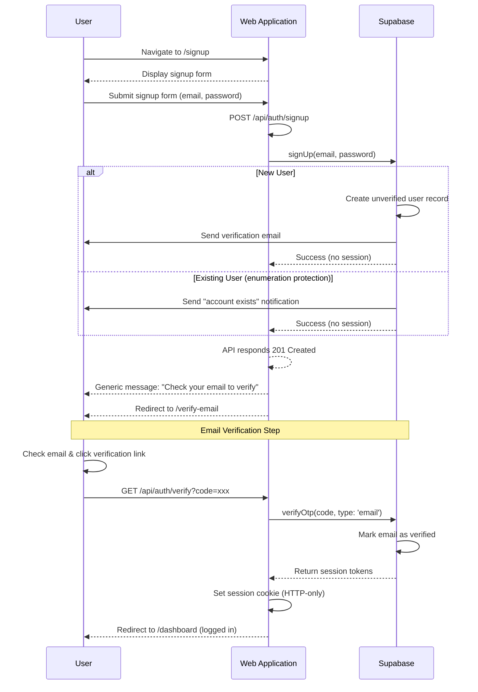
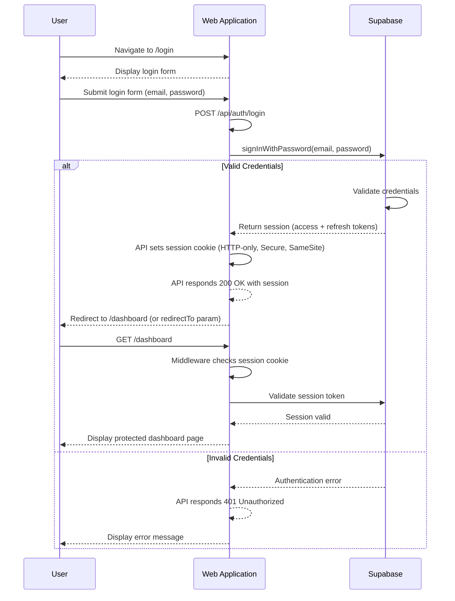
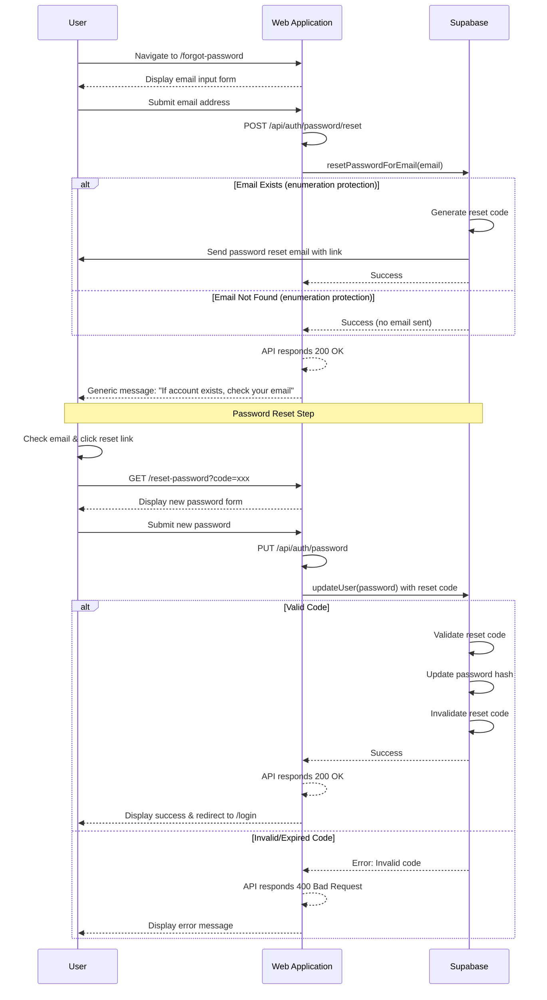

# Authentication Sequence Diagrams

This document contains focused sequence diagrams for the three main authentication flows in the YourFaves application.

## 1. Sign Up Flow

## 2. Login Flow

## 3. Forgot Password Flow

## API Architecture

The Web Application implements a **RESTful API layer** that acts as an intermediary between the frontend pages and Supabase Auth. This architecture provides:

### API Endpoints

| Method | Endpoint | Purpose |
|--------|----------|---------|
| `POST` | `/api/auth/signup` | Register new user account |
| `GET` | `/api/auth/verify` | Verify email with code from link |
| `POST` | `/api/auth/login` | Authenticate user and create session |
| `POST` | `/api/auth/logout` | End user session |
| `POST` | `/api/auth/refresh` | Refresh expiring session |
| `POST` | `/api/auth/password/reset` | Request password reset email |
| `PUT` | `/api/auth/password` | Update user password |
| `GET` | `/api/auth/session` | Get current session status |

### Benefits of API Layer
- **Abstraction** - Frontend doesn't directly depend on Supabase client
- **Security** - Sensitive operations handled server-side
- **Validation** - Centralized input validation and sanitization
- **Logging** - Audit logging for all authentication events
- **Flexibility** - Easier to switch auth providers in the future

## Key Security Features

### User Enumeration Protection
Both the **Sign Up** and **Forgot Password** flows implement user enumeration protection by returning the same generic success message regardless of whether the email exists in the system. This prevents attackers from discovering valid email addresses.

**Implementation:**
- `/api/auth/signup` always returns `201 Created` with generic message
- `/api/auth/password/reset` always returns `200 OK` with generic message
- Emails sent selectively based on actual account status

### Session Management
- Sessions are stored in **HTTP-only cookies** to prevent XSS attacks
- Cookies use **Secure** flag (HTTPS only in production)
- **SameSite=Lax** prevents CSRF attacks
- Session tokens include both **access tokens** (short-lived) and **refresh tokens** (long-lived)
- Cookies set by `/api/auth/login` and `/api/auth/verify` endpoints

### Middleware Protection
The Web Application's middleware automatically:
- Validates session on every request to `/dashboard/*` routes
- Refreshes expiring sessions automatically via `/api/auth/refresh`
- Redirects unauthenticated users to login with `redirectTo` parameter
- Stores session state in secure cookies

### Email Verification Requirement
New users cannot access protected routes until they verify their email address via the `/api/auth/verify` endpoint. This ensures:
- Email ownership validation
- Reduces spam/bot registrations
- Enables account recovery options
