# Authentication

This document outlines the authentication mechanisms used in the YourFaves application to ensure secure access to its features and data.

## Overview

YourFaces will utilise Superbase Authentication for handling its authentication requirements. This includes managing user sign up, login, password resets and session management.

Authentication will be integrated seamlessly with the Next.js application in order to restrict access to dashboard/\* routes.

The dashboard routes will be protected in order to provide authenticated users protected access to manage their lists and personal data.

## Session Management

Session management in YourFaves is a collaborative effort between Supabase and Next.js, with each handling specific responsibilities:

### Supabase Responsibilities

- **Session creation** - Generates access tokens and refresh tokens when users authenticate
- **Token validation** - Verifies that tokens are legitimate and not expired
- **Token refresh** - Automatically exchanges refresh tokens for new access tokens
- **Session storage** - Persists session data server-side in the database
- **Session invalidation** - Revokes sessions when users log out

### Next.js Responsibilities

- **Cookie management** - Stores session tokens in secure HTTP-only cookies
- **Session retrieval** - Reads session data from cookies on each request
- **Middleware enforcement** - Checks session validity before granting access to protected routes
- **Cookie updates** - Updates cookies when sessions are refreshed
- **Route protection** - Implements middleware to restrict access to `/dashboard/*` routes

### Integration

The application uses the `@supabase/ssr` package to seamlessly integrate Supabase authentication with Next.js server-side rendering and middleware capabilities. This ensures:

- Secure cookie-based session storage
- Automatic session refresh on the server
- Efficient session validation without client-side exposure of tokens
- Consistent authentication state across server and client components

## API Routes

The following RESTful API routes handle authentication operations:

### Authentication Endpoints

| Method | Endpoint                   | Description                    | Request Body                       | Response                           |
| ------ | -------------------------- | ------------------------------ | ---------------------------------- | ---------------------------------- |
| `POST` | `/api/auth/signup`         | Register a new user account    | `{ email, password }`              | `{ success, message }`             |
| `GET`  | `/api/auth/verify`         | Verify email address via token | Query: `?token=xxx`                | Redirect to dashboard with session |
| `POST` | `/api/auth/login`          | Authenticate existing user     | `{ email, password, redirectTo? }` | `{ session }` or error             |
| `POST` | `/api/auth/logout`         | End user session               | -                                  | `{ success: true }`                |
| `POST` | `/api/auth/refresh`        | Refresh an expiring session    | -                                  | `{ session }` or error             |
| `POST` | `/api/auth/password/reset` | Request password reset email   | `{ email }`                        | `{ success: true }`                |
| `PUT`  | `/api/auth/password`       | Update user password           | `{ password, token? }`             | `{ success: true }` or error       |
| `GET`  | `/api/auth/session`        | Get current session status     | -                                  | `{ session, user }` or `null`      |

### Route Details

#### `POST /api/auth/signup`

Creates a new user account with email and password.

**Request:**

```json
{
  "email": "user@example.com",
  "password": "securePassword123"
}
```

**Success Response (201):**

```json
{
  "success": true,
  "message": "Please check your email to verify your account"
}
```

**Note:** For security, the response does not reveal whether the email is already registered. Users receive appropriate emails based on account status.

#### `GET /api/auth/verify`

Verifies a user's email address using the token from the verification email.

**Query Parameters:**

- `token` - The verification token from the email link
- `type` - Optional, defaults to "signup"

**Success Flow:**

1. Token is validated
2. User's email is marked as verified in the database
3. Session is created
4. User is redirected to `/dashboard` with session cookie set

**Error Response (400):**

```json
{
  "error": "Invalid or expired verification token"
}
```

## Implementation Breakdown

This section breaks down the authentication system implementation into manageable tasks, each approximately 600 lines of code or less. Tasks are ordered by dependency and priority.

### Phase 1: Foundation & Core Setup

#### Task 1.1: Supabase Configuration & Environment Setup

**Estimated Size:** ~200 lines  
**Priority:** Critical (Blocking)  
**Dependencies:** None

**Deliverables:**

- Install required packages (`@supabase/supabase-js`, `@supabase/ssr`, `@supabase/auth-helpers-nextjs`)
- Configure environment variables (`.env.local`)
- Create Supabase client utilities for server and client components
- Set up TypeScript types for auth responses

**Files Created/Modified:**

- `/lib/supabase/client.ts` - Client-side Supabase client
- `/lib/supabase/server.ts` - Server-side Supabase client
- `/lib/supabase/middleware.ts` - Middleware helper
- `/types/auth.ts` - Authentication type definitions
- `.env.local` - Environment configuration
- `package.json` - Dependencies

**Acceptance Criteria:**

- Supabase clients instantiate without errors
- Environment variables load correctly
- TypeScript types compile successfully

---

#### Task 1.2: Database Schema & Supabase Auth Configuration

**Estimated Size:** ~150 lines (SQL + config)  
**Priority:** Critical (Blocking)  
**Dependencies:** Task 1.1

**Deliverables:**

- Configure Supabase Auth settings (email confirmation, password requirements)
- Set up email templates for verification and password reset
- Configure Row Level Security (RLS) policies for user data
- Create any additional user profile tables if needed

**Files Created/Modified:**

- `/supabase/migrations/001_initial_auth_setup.sql` - Database schema
- Supabase Dashboard configuration (documented in migration notes)

**Acceptance Criteria:**

- Email verification is required for new accounts
- Password policy enforces 12+ characters with complexity
- RLS policies prevent unauthorized data access
- Email templates display correctly

---

### Phase 2: Authentication API Routes

#### Task 2.1: Signup & Email Verification Endpoints

**Estimated Size:** ~400 lines  
**Priority:** High  
**Dependencies:** Task 1.1, Task 1.2

**Deliverables:**

- Create signup API route with user enumeration protection
- Create email verification handler
- Implement input validation and sanitization
- Add error handling and logging
- Create redirect to verification page

**Files Created/Modified:**

- `/app/api/auth/signup/route.ts` - Signup endpoint (~150 lines)
- `/app/api/auth/verify/route.ts` - Email verification endpoint (~100 lines)
- `/lib/validation/auth.ts` - Input validation schemas (~80 lines)
- `/lib/auth/errors.ts` - Custom error classes (~70 lines)

**Acceptance Criteria:**

- Signup returns generic message for new and existing users
- Verification emails sent successfully
- Email verification creates session and redirects to dashboard
- Invalid tokens return appropriate errors
- All inputs validated before processing

---

#### Task 2.2: Login & Logout Endpoints

**Estimated Size:** ~350 lines  
**Priority:** High  
**Dependencies:** Task 1.1

**Deliverables:**

- Create login API route with redirectTo validation
- Create logout API route
- Implement redirect URL validation (prevent open redirects)
- Add rate limiting preparation hooks
- Session cookie management

**Files Created/Modified:**

- `/app/api/auth/login/route.ts` - Login endpoint (~180 lines)
- `/app/api/auth/logout/route.ts` - Logout endpoint (~80 lines)
- `/lib/auth/redirect-validation.ts` - Redirect URL validation (~90 lines)

**Acceptance Criteria:**

- Login authenticates users and creates sessions
- redirectTo parameter validated (only relative paths)
- Logout invalidates sessions and clears cookies
- Failed login attempts logged
- Sessions stored in HTTP-only cookies

---

#### Task 2.3: Password Reset & Update Endpoints

**Estimated Size:** ~400 lines  
**Priority:** Medium  
**Dependencies:** Task 1.1, Task 1.2

**Deliverables:**

- Create password reset request endpoint
- Create password update endpoint
- Implement user enumeration protection for reset
- Add password strength validation
- Handle both authenticated and token-based password updates

**Files Created/Modified:**

- `/app/api/auth/password/reset/route.ts` - Password reset request (~120 lines)
- `/app/api/auth/password/route.ts` - Password update endpoint (~150 lines)
- `/lib/validation/password.ts` - Password validation (~80 lines)
- `/lib/auth/password-strength.ts` - Password strength checker (~50 lines)

**Acceptance Criteria:**

- Reset endpoint returns generic message
- Reset emails sent only to valid accounts
- Password update requires valid token or active session
- Passwords validated against complexity requirements
- Users can update password from both reset flow and authenticated state

---

#### Task 2.4: Session Management Endpoints

**Estimated Size:** ~250 lines  
**Priority:** Medium  
**Dependencies:** Task 1.1

**Deliverables:**

- Create session refresh endpoint
- Create session status endpoint
- Implement automatic token refresh logic
- Add session validation utilities

**Files Created/Modified:**

- `/app/api/auth/refresh/route.ts` - Session refresh endpoint (~100 lines)
- `/app/api/auth/session/route.ts` - Session status endpoint (~80 lines)
- `/lib/auth/session.ts` - Session utilities (~70 lines)

**Acceptance Criteria:**

- Refresh endpoint returns new session tokens
- Session endpoint returns current user and session data
- Expired refresh tokens handled gracefully
- Session utilities work on both client and server

---

### Phase 3: Middleware & Route Protection

#### Task 3.1: Authentication Middleware

**Estimated Size:** ~350 lines  
**Priority:** Critical  
**Dependencies:** Task 2.1, Task 2.2

**Deliverables:**

- Create Next.js middleware for route protection
- Implement session checking logic
- Add automatic session refresh
- Handle redirectTo parameter for protected routes
- Configure public vs protected route patterns

**Files Created/Modified:**

- `/middleware.ts` - Main middleware (~200 lines)
- `/lib/auth/middleware-helpers.ts` - Helper functions (~100 lines)
- `/lib/auth/route-config.ts` - Route protection configuration (~50 lines)

**Acceptance Criteria:**

- `/dashboard/*` routes protected (redirect to login if unauthenticated)
- Public routes (`/login`, `/signup`, etc.) accessible without auth
- redirectTo parameter preserved when redirecting to login
- Sessions automatically refreshed when near expiry
- Middleware runs efficiently on edge runtime

---

### Phase 4: UI Components & Pages

#### Task 4.1: Authentication UI Components

**Estimated Size:** ~400 lines  
**Priority:** High  
**Dependencies:** Task 2.1, Task 2.2, Task 2.3

**Design Status:** ⚠️ No designs available - implement barebone HTML only

**Important:** This task focuses on **functional HTML structure only**. CSS styling will be added in a future phase once designs are finalized. Keep markup semantic and accessible, but do not add custom styling beyond browser defaults.

**Deliverables:**

- Create reusable form components (basic HTML inputs, buttons, error display)
- Create password strength indicator (text-based feedback)
- Create loading states and feedback components (basic disabled states)
- Implement form validation on client-side (HTML5 validation attributes)
- Add accessibility features (ARIA labels, keyboard navigation, semantic HTML)

**Files Created/Modified:**

- `/components/auth/form-input.tsx` - Reusable input component (~80 lines)
- `/components/auth/password-input.tsx` - Password input with strength indicator (~100 lines)
- `/components/auth/form-button.tsx` - Submit button with loading state (~50 lines)
- `/components/auth/error-message.tsx` - Error display component (~40 lines)
- `/components/auth/auth-card.tsx` - Auth page wrapper component (~60 lines)
- `/lib/hooks/use-form-state.ts` - Form state management hook (~90 lines)

**Implementation Guidelines:**

- Use native HTML elements (`<input>`, `<button>`, `<form>`, etc.)
- Use HTML5 validation attributes (`required`, `type="email"`, `minlength`, etc.)
- Use semantic HTML (`<label>`, `<fieldset>`, proper heading hierarchy)
- Password strength: Display as plain text (e.g., "Weak", "Medium", "Strong")
- Loading state: Use `disabled` attribute on buttons
- Errors: Display as plain text in a `<div>` or `<p>` element
- No CSS classes for styling (utility classes like Tailwind are fine for structure/layout only if already in project)
- Focus on functionality and accessibility over aesthetics

**Acceptance Criteria:**

- All form components render functional HTML
- Password strength indicator shows text-based feedback
- Loading states prevent double submissions via disabled attribute
- Error messages display as plain text
- Components are accessible (WCAG 2.1 AA) with proper ARIA labels and semantic markup
- No custom CSS added (browser default styling only)
- Forms are fully functional without JavaScript (progressive enhancement)

---

#### Task 4.2: Signup & Verification Pages

**Estimated Size:** ~350 lines  
**Priority:** High  
**Dependencies:** Task 4.1, Task 2.1

**Design Status:** ⚠️ No designs available - implement barebone HTML only

**Deliverables:**

- Create signup page with form (semantic HTML)
- Create email verification waiting page (plain text instructions)
- Create email verified success page (simple confirmation message)
- Implement client-side validation (HTML5 attributes)
- Add SEO metadata

**Files Created/Modified:**

- `/app/signup/page.tsx` - Signup page (~140 lines)
- `/app/verify-email/page.tsx` - Check email page (~80 lines)
- `/app/auth/verify/page.tsx` - Verification handler page (~100 lines)
- `/lib/actions/auth-actions.ts` - Server actions for forms (~50 lines)

**Implementation Guidelines:**

- Use plain HTML forms with native validation
- Keep pages simple and text-focused
- Use browser default styling only
- Ensure mobile responsiveness through semantic HTML (not CSS)

**Acceptance Criteria:**

- Signup form validates input before submission
- Success redirects to verification waiting page
- Verification page shows clear text instructions
- Email verification link redirects to dashboard
- All pages functional on mobile (semantic HTML ensures basic responsiveness)
- No custom styling applied

---

#### Task 4.3: Login & Logout Pages

**Estimated Size:** ~300 lines  
**Priority:** High  
**Dependencies:** Task 4.1, Task 2.2

**Design Status:** ⚠️ No designs available - implement barebone HTML only

**Deliverables:**

- Create login page with form (semantic HTML)
- Add "Remember me" functionality (optional, checkbox only)
- Handle redirectTo parameter in UI
- Add social auth placeholders (if planned for future - simple disabled buttons)

**Files Created/Modified:**

- `/app/login/page.tsx` - Login page (~150 lines)
- `/components/auth/login-form.tsx` - Login form component (~120 lines)
- `/app/api/auth/logout/route.ts` - Already created in Task 2.2 (modifications ~30 lines)

**Implementation Guidelines:**

- Use native HTML form elements
- Keep layout simple and functional
- No custom CSS - browser defaults only
- Use standard HTML checkboxes for "Remember me"

**Acceptance Criteria:**

- Login form submits to API route
- redirectTo parameter preserved through flow
- Failed login shows plain text error message
- Success redirects to intended destination or dashboard
- "Forgot password" link navigates correctly
- No custom styling applied

---

#### Task 4.4: Password Reset & Update Pages

**Estimated Size:** ~400 lines  
**Priority:** Medium  
**Dependencies:** Task 4.1, Task 2.3

**Design Status:** ⚠️ No designs available - implement barebone HTML only

**Deliverables:**

- Create forgot password page (simple form)
- Create password reset page (with token)
- Create password change page (for authenticated users)
- Add password confirmation fields
- Implement client-side password matching validation (HTML5)

**Files Created/Modified:**

- `/app/forgot-password/page.tsx` - Forgot password page (~100 lines)
- `/app/reset-password/page.tsx` - Reset password page (~120 lines)
- `/app/dashboard/settings/password/page.tsx` - Change password page (~110 lines)
- `/components/auth/password-reset-form.tsx` - Password reset form (~70 lines)

**Implementation Guidelines:**

- Use native HTML forms and validation
- Password matching: Use HTML5 pattern matching or simple JS validation
- Display messages as plain text
- Keep forms minimal and functional

**Acceptance Criteria:**

- Forgot password shows generic success message (plain text)
- Reset password page validates token on load
- Password and confirm password must match (client-side validation)
- Success messages displayed as plain text
- Expired tokens show plain text error messages
- No custom styling applied

---

### Phase 5: Security Hardening & Testing

#### Task 5.1: Security Implementation

**Estimated Size:** ~400 lines  
**Priority:** High  
**Dependencies:** All Phase 2 & 3 tasks

**Deliverables:**

- Implement audit logging for all auth events
- Add CSRF protection verification
- Implement input sanitization
- Add security headers configuration
- Create rate limiting preparation (hooks for future implementation)

**Files Created/Modified:**

- `/lib/auth/audit-logger.ts` - Audit logging service (~150 lines)
- `/lib/security/sanitization.ts` - Input sanitization utilities (~100 lines)
- `/lib/security/headers.ts` - Security headers configuration (~80 lines)
- `/lib/security/rate-limit-hooks.ts` - Rate limit preparation (~70 lines)
- `next.config.js` - Security headers config (modifications ~20 lines)

**Acceptance Criteria:**

- All auth events logged to Supabase
- Security headers present in responses (HSTS, CSP, etc.)
- User inputs sanitized before processing
- CSRF tokens validated where applicable
- Rate limit hooks ready for future integration

---

#### Task 5.2: Error Handling & User Feedback

**Estimated Size:** ~350 lines  
**Priority:** Medium  
**Dependencies:** All Phase 2 & 4 tasks

**Deliverables:**

- Standardize error responses across all endpoints
- Create user-friendly error messages
- Implement global error boundary
- Add toast notifications for feedback
- Create error logging service

**Files Created/Modified:**

- `/lib/errors/error-handler.ts` - Centralized error handler (~120 lines)
- `/lib/errors/error-messages.ts` - User-facing error messages (~100 lines)
- `/components/error-boundary.tsx` - Error boundary component (~80 lines)
- `/lib/notifications/toast.ts` - Toast notification service (~50 lines)

**Acceptance Criteria:**

- Consistent error format across all API routes
- Technical errors translated to user-friendly messages
- Errors logged without exposing sensitive data
- Toast notifications work on all auth pages
- Error boundary catches unexpected errors

---

#### Task 5.3: Testing Suite

**Estimated Size:** ~600 lines  
**Priority:** High  
**Dependencies:** All previous tasks

**Deliverables:**

- Unit tests for validation functions
- Integration tests for API routes
- E2E tests for critical flows (signup, login, password reset)
- Security tests (enumeration, open redirect, CSRF)
- Test fixtures and mocking utilities

**Files Created/Modified:**

- `/tests/unit/validation.test.ts` - Validation tests (~100 lines)
- `/tests/unit/auth-helpers.test.ts` - Helper function tests (~100 lines)
- `/tests/integration/signup.test.ts` - Signup flow tests (~100 lines)
- `/tests/integration/login.test.ts` - Login flow tests (~100 lines)
- `/tests/integration/password-reset.test.ts` - Password reset tests (~100 lines)
- `/tests/e2e/auth-flows.spec.ts` - E2E tests (~100 lines)

**Acceptance Criteria:**

- All unit tests pass with >90% coverage
- Integration tests cover happy and error paths
- E2E tests verify complete user flows
- Security tests verify enumeration protection and redirect validation
- CI/CD pipeline runs tests automatically

---

### Phase 6: Documentation & Deployment

#### Task 6.1: Developer Documentation

**Estimated Size:** ~300 lines (documentation)  
**Priority:** Medium  
**Dependencies:** All previous tasks

**Deliverables:**

- API route documentation with examples
- Environment setup guide
- Local development instructions
- Supabase configuration guide
- Troubleshooting guide

**Files Created/Modified:**

- `/docs/development/setup.md` - Setup instructions
- `/docs/development/api-reference.md` - API documentation
- `/docs/development/troubleshooting.md` - Common issues
- `README.md` - Updated with auth setup instructions

**Acceptance Criteria:**

- New developers can set up auth locally using docs
- All API routes documented with curl examples
- Common errors documented with solutions
- Environment variables explained clearly

---

#### Task 6.2: Deployment & Monitoring Setup

**Estimated Size:** ~250 lines (config + monitoring)  
**Priority:** High  
**Dependencies:** All Phase 5 tasks

**Deliverables:**

- Production environment configuration
- Supabase production setup
- Error monitoring integration (e.g., Sentry)
- Analytics setup for auth events
- Health check endpoints

**Files Created/Modified:**

- `/app/api/health/route.ts` - Health check endpoint (~50 lines)
- `/lib/monitoring/sentry.ts` - Error monitoring setup (~80 lines)
- `/lib/analytics/auth-events.ts` - Analytics tracking (~70 lines)
- `.env.production` - Production environment template
- `/docs/deployment/production-setup.md` - Deployment guide (~50 lines)

**Acceptance Criteria:**

- Production environment variables configured
- Supabase production instance connected
- Errors logged to monitoring service
- Auth events tracked in analytics
- Health check returns system status

---

## Implementation Timeline Estimate

**Total Estimated Lines of Code:** ~5,400 lines (excluding future CSS styling)

### Recommended Sprint Breakdown (2-week sprints):

**Sprint 1 - Foundation** (Tasks 1.1, 1.2, 2.1)

- Core setup and signup flow
- ~750 lines

**Sprint 2 - Core Auth** (Tasks 2.2, 2.3, 2.4)

- Login, logout, password management, session management
- ~1,000 lines

**Sprint 3 - Protection & UI Foundation** (Tasks 3.1, 4.1)

- Middleware and reusable components
- ~850 lines

**Sprint 4 - Auth Pages** (Tasks 4.2, 4.3, 4.4)

- All user-facing pages
- ~850 lines
- **Note:** Barebone HTML only, no custom styling

**Sprint 5 - Security & Testing** (Tasks 5.1, 5.2, 5.3)

- Hardening and comprehensive testing
- ~1,350 lines

**Sprint 6 - Polish & Deploy** (Tasks 6.1, 6.2)

- Documentation and production deployment
- ~550 lines

**Total Duration:** 12 weeks (3 months) for full implementation

**Future Phase - UI Styling:**

- CSS implementation will be added once designs are finalized
- Estimated ~300-500 additional lines of styling code
- Can be done in parallel with feature development after MVP

## Task Dependencies Diagram

```
1.1 (Supabase Setup)
  ├─→ 1.2 (Database Schema)
  │     └─→ 2.1 (Signup & Verify)
  │     └─→ 2.3 (Password Reset)
  ├─→ 2.2 (Login & Logout)
  │     └─→ 3.1 (Middleware)
  │           └─→ 4.2 (Signup Pages)
  │           └─→ 4.3 (Login Pages)
  ├─→ 2.4 (Session Management)
  └─→ 4.1 (UI Components)
        └─→ 4.4 (Password Pages)

All Phase 2-4 → 5.1 (Security)
              → 5.2 (Error Handling)
              → 5.3 (Testing)
                └─→ 6.1 (Documentation)
                └─→ 6.2 (Deployment)
```

````

#### `POST /api/auth/login`
Authenticates a user and creates a new session.

**Request:**
```json
{
  "email": "user@example.com",
  "password": "securePassword123",
  "redirectTo": "/dashboard/my-lists"
}
````

**Success Response (200):**

```json
{
  "session": {
    "access_token": "...",
    "refresh_token": "..."
  },
  "redirectTo": "/dashboard/my-lists"
}
```

#### `POST /api/auth/logout`

Invalidates the current user session.

**Success Response (200):**

```json
{
  "success": true
}
```

#### `POST /api/auth/refresh`

Refreshes an expiring session using the refresh token.

**Success Response (200):**

```json
{
  "session": {
    "access_token": "...",
    "refresh_token": "..."
  }
}
```

#### `POST /api/auth/password/reset`

Sends a password reset email to the user.

**Request:**

```json
{
  "email": "user@example.com"
}
```

**Success Response (200):**

```json
{
  "success": true,
  "message": "If an account exists with this email, a password reset link has been sent"
}
```

**Note:** For security, the response does not reveal whether the email is registered. Reset emails are only sent to valid accounts.

````

#### `PUT /api/auth/password`
Updates the user's password. Requires either an active session or a valid reset token.

**Request:**
```json
{
  "password": "newSecurePassword123",
  "token": "reset-token-from-email"
}
````

**Success Response (200):**

```json
{
  "success": true,
  "message": "Password updated successfully"
}
```

#### `GET /api/auth/session`

Retrieves the current session and user information.

**Success Response (200):**

```json
{
  "session": {
    "access_token": "...",
    "expires_at": 1234567890
  },
  "user": {
    "id": "uuid",
    "email": "user@example.com"
  }
}
```

**No Session Response (200):**

```json
null
```

### RESTful Design Principles

These routes follow RESTful conventions:

- **Resource-based URLs** - Routes are organized around the `auth` resource
- **HTTP methods** - Appropriate use of POST (create), PUT (update), GET (retrieve)
- **Stateless** - Each request contains all necessary information
- **Standard status codes** - 200 (success), 201 (created), 400 (bad request), 401 (unauthorized), 500 (server error)
- **JSON format** - Consistent request/response format

## Security Considerations

### Redirect URL Validation

**Critical:** The `redirectTo` parameter in login requests must be strictly validated to prevent open redirect vulnerabilities.

**Implementation Requirements:**

- Only allow relative paths starting with `/` (e.g., `/dashboard/my-lists`)
- Reject absolute URLs unless they match the application's domain
- Default to `/dashboard` if `redirectTo` is invalid or missing

**Example Validation:**

```typescript
function isValidRedirect(url: string): boolean {
  // Only allow relative paths
  if (!url.startsWith("/")) return false;

  // Prevent protocol-relative URLs
  if (url.startsWith("//")) return false;

  // Prevent javascript: and data: URLs
  if (url.match(/^(javascript|data):/i)) return false;

  return true;
}
```

### Rate Limiting

**Status:** Deferred to post-MVP

Public authentication endpoints are vulnerable to brute-force attacks and credential stuffing. Rate limiting will be implemented in a future phase using one of the following solutions:

**Recommended Solutions:**

- **Upstash Rate Limit** - Serverless rate limiting with Redis
- **Vercel Edge Middleware Rate Limiting** - Built-in edge-based protection
- **Arcjet** - Security-as-a-service with rate limiting for Next.js

**Planned Limits (Post-MVP):**

- `/api/auth/login` - 5 attempts per 15 minutes per IP
- `/api/auth/signup` - 3 attempts per hour per IP
- `/api/auth/password/reset` - 3 attempts per hour per email

**MVP Mitigation:**

- Rely on Supabase's built-in rate limiting for authentication endpoints
- Monitor authentication logs for suspicious patterns

### User Enumeration Protection

To prevent attackers from discovering valid email addresses, the application implements the following protections:

#### Signup Endpoint

**Response Behavior:**

- Always return 201 Created with a generic success message
- Do not distinguish between "email already registered" and "new account created"
- Send appropriate email (confirmation for new users, "account exists" notification for existing users)

**Response:**

```json
{
  "success": true,
  "message": "Please check your email to verify your account"
}
```

#### Password Reset Endpoint

**Response Behavior:**

- Always return 200 OK with the same message regardless of whether the email exists
- Only send reset emails to registered accounts
- Do not reveal whether an account exists

**Response:**

```json
{
  "success": true,
  "message": "If an account exists with this email, a password reset link has been sent"
}
```

### Password Policy

All user passwords must meet the following requirements:

**Minimum Requirements:**

- Minimum length: 12 characters
- Must contain at least one uppercase letter
- Must contain at least one lowercase letter
- Must contain at least one number
- Must contain at least one special character

**Additional Rules:**

- Passwords cannot contain common patterns (e.g., "password123", "qwerty")
- Passwords are checked against known breach databases using Supabase's integration
- Users are encouraged (but not required) to use passphrases for better security

**Implementation:**

- Validation occurs on both client-side (UX) and server-side (security)
- Password strength indicator shown during signup and password changes

### Audit Logging

All authentication events are logged for security monitoring and compliance:

**Logged Events:**

- Successful login attempts (timestamp, IP, user agent)
- Failed login attempts (timestamp, IP, attempted email)
- Password changes (timestamp, IP)
- Password reset requests (timestamp, IP, email)
- Account creation (timestamp, IP)
- Session invalidation/logout (timestamp, IP)

**Log Retention:**

- Authentication logs retained for 90 days
- Logs stored securely in Supabase with restricted access
- Accessible only to administrators for security auditing

**Monitoring:**

- Automated alerts for suspicious patterns (e.g., multiple failed logins)
- Weekly review of authentication anomalies

### Multi-Factor Authentication (MFA)

**Status:** Out of scope for MVP

MFA is planned for a future release to provide enhanced account security. Supabase supports:

- Time-based One-Time Passwords (TOTP)
- SMS-based verification
- Email-based verification codes

**Future Implementation:**

- Optional MFA during MVP phase
- Mandatory MFA for accounts with elevated privileges in future phases

### Additional Security Measures

**Session Security:**

- HTTP-only cookies prevent XSS attacks
- Secure flag ensures cookies only sent over HTTPS
- SameSite=Lax prevents CSRF attacks
- Session tokens automatically rotated on refresh

**HTTPS Enforcement:**

- All authentication endpoints require HTTPS in production
- HTTP Strict Transport Security (HSTS) headers enabled

**Input Validation:**

- Email format validation using RFC 5322 standards
- SQL injection prevention via Supabase's parameterized queries
- XSS prevention through proper output encoding

## Authentication Flow

```mermaid
sequenceDiagram
    participant User
    participant Browser
    participant NextJS as Next.js App
    participant Middleware as Next.js Middleware
    participant Supabase as Supabase Auth
    participant Database as Supabase DB

    Note over User,Database: User Sign Up Flow
    User->>Browser: Navigate to signup page
    Browser->>NextJS: GET /signup
    NextJS-->>Browser: Return signup form
    User->>Browser: Submit signup form (email, password)
    Browser->>NextJS: POST /api/auth/signup
    NextJS->>Supabase: signUp(email, password)

    alt New User
        Supabase->>Database: Create user record (unverified)
        Database-->>Supabase: User created
        Supabase->>User: Send verification email
        Supabase-->>NextJS: Return success (no session)
    else Existing User
        Supabase->>User: Send "account exists" notification
        Supabase-->>NextJS: Return success (no session)
    end

    NextJS-->>Browser: Generic success response
    NextJS-->>Browser: Redirect to /verify-email page

    Note over User,Database: Email Verification
    User->>Browser: Click verification link in email
    Browser->>NextJS: GET /auth/verify?token=xxx
    NextJS->>Supabase: verifyEmail(token)
    Supabase->>Database: Mark email as verified
    Database-->>Supabase: Email verified
    Supabase-->>NextJS: Return session
    NextJS->>Browser: Set session cookie
    NextJS-->>Browser: Redirect to /dashboard

    Note over User,Database: User Login Flow
    User->>Browser: Navigate to login page
    Browser->>NextJS: GET /login
    NextJS-->>Browser: Return login form
    User->>Browser: Submit login form (email, password)
    Browser->>NextJS: POST /api/auth/login
    NextJS->>Supabase: signInWithPassword(email, password)
    Supabase->>Database: Validate credentials
    Database-->>Supabase: User validated
    Supabase-->>NextJS: Return session
    NextJS->>Browser: Set session cookie
    NextJS-->>Browser: Redirect to /dashboard
    Browser->>NextJS: GET /dashboard
    NextJS-->>Browser: Return dashboard page

    Note over User,Database: Protected Route Access
    User->>Browser: Navigate to /dashboard/*
    Browser->>NextJS: GET /dashboard/my-lists
    NextJS->>Middleware: Check route protection
    Middleware->>Supabase: getSession() from cookie

    alt Session Valid
        Supabase-->>Middleware: Return valid session
        Middleware-->>NextJS: Allow access
        NextJS-->>Browser: Return protected page
    else Session Invalid/Expired
        Supabase-->>Middleware: No valid session
        Middleware->>Middleware: Store redirect URL (/dashboard/my-lists)
        Middleware-->>Browser: Redirect to /login?redirectTo=/dashboard/my-lists
        User->>Browser: Complete login
        Browser->>NextJS: POST /api/auth/login (with redirectTo param)
        NextJS->>Supabase: signInWithPassword(email, password)
        Supabase-->>NextJS: Return session
        NextJS->>Browser: Set session cookie
        NextJS-->>Browser: Redirect to original URL (/dashboard/my-lists)
    end

    Note over User,Database: Password Reset Flow
    User->>Browser: Navigate to forgot password
    Browser->>NextJS: GET /forgot-password
    NextJS-->>Browser: Return reset form
    User->>Browser: Submit email
    Browser->>NextJS: POST /api/auth/password/reset
    NextJS->>Supabase: resetPasswordForEmail(email)
    Supabase->>User: Send reset email
    User->>Browser: Click reset link in email
    Browser->>NextJS: GET /reset-password?token=xxx
    NextJS-->>Browser: Return new password form
    User->>Browser: Submit new password
    Browser->>NextJS: PUT /api/auth/password
    NextJS->>Supabase: updateUser({ password })
    Supabase->>Database: Update password
    Database-->>Supabase: Password updated
    Supabase-->>NextJS: Return success
    NextJS-->>Browser: Redirect to /login

    Note over User,Database: Session Refresh Flow
    Browser->>NextJS: Request to protected route
    NextJS->>Middleware: Check session
    Middleware->>Supabase: getSession()

    alt Session Near Expiry
        Supabase-->>Middleware: Session expiring soon
        Middleware->>NextJS: POST /api/auth/refresh
        NextJS->>Supabase: refreshSession()
        Supabase->>Database: Validate refresh token
        Database-->>Supabase: Token valid
        Supabase-->>NextJS: New session
        NextJS->>Middleware: Return updated session
        Middleware->>Browser: Update session cookie
        Middleware-->>NextJS: Allow access
        NextJS-->>Browser: Return requested page
    else Session Expired
        Supabase-->>Middleware: Session expired
        Middleware-->>Browser: Redirect to /login
    end

    Note over User,Database: User Logout Flow
    User->>Browser: Click logout
    Browser->>NextJS: POST /api/auth/logout
    NextJS->>Supabase: signOut()
    Supabase->>Database: Invalidate session
    Database-->>Supabase: Session invalidated
    Supabase-->>NextJS: Success
    NextJS->>Browser: Clear session cookie
    NextJS-->>Browser: Redirect to /login
```



## Authentication Flows Explained

### 1. User Sign Up

- User navigates to the signup page and submits their email and password
- Next.js calls Supabase's `signUp()` method
- For security (user enumeration protection):
  - New users: Supabase creates an unverified user record and sends a verification email
  - Existing users: Supabase sends an "account exists" notification email
  - API returns the same generic success message in both cases
- User is redirected to a "Check your email" page (not logged in yet)
- User clicks the verification link in their email
- Email is verified and a session is created
- User is then redirected to the dashboard and logged in

### 2. User Login

- User submits credentials via the login form
- Next.js authenticates using Supabase's `signInWithPassword()`
- Upon successful validation, a session is created
- Session cookie is set and user gains access to protected routes

### 3. Protected Route Access

- Next.js Middleware intercepts requests to `/dashboard/*` routes
- Session validity is checked via `getSession()`
- Valid sessions allow access to the requested page
- Invalid/expired sessions:
  - Store the original requested URL (e.g., `/dashboard/my-lists`)
  - Redirect to login with the URL as a query parameter (`/login?redirectTo=/dashboard/my-lists`)
  - After successful login, redirect user back to their originally requested URL

### 4. Password Reset

- User requests password reset with their email
- Supabase sends a reset link via email
- User clicks the link and submits a new password
- Password is updated in the database

### 5. Session Refresh

- Middleware automatically detects expiring sessions
- Refresh token is used to obtain a new session
- Session cookie is updated seamlessly
- Expired sessions trigger re-authentication

### 6. User Logout

- User initiates logout
- Supabase invalidates the session in the database
- Session cookie is cleared
- User is redirected to the login page
