# Authentication 
This document outlines the authentication mechanisms used in the YourFaves application to ensure secure access to its features and data.

## Overview
YourFaces will utilise Superbase Authentication for handling its authentication requirements. This includes managing user sign up, login, password resets and session management. 

Authentication will be integrated seamlessly with the Next.js application in order to restrict access to dashboard/* routes.

The dashboard routes will be protected in order to provide authenticated users protected access to manage their lists and personal data.

## Session Management

Session management in YourFaves is a collaborative effort between Supabase and Next.js, with each handling specific responsibilities:

### Supabase Responsibilities
- **Session creation** - Generates access tokens and refresh tokens when users authenticate
- **Token validation** - Verifies that tokens are legitimate and not expired
- **Token refresh** - Automatically exchanges refresh tokens for new access tokens
- **Session storage** - Persists session data server-side in the database
- **Session invalidation** - Revokes sessions when users log out

### Next.js Responsibilities
- **Cookie management** - Stores session tokens in secure HTTP-only cookies
- **Session retrieval** - Reads session data from cookies on each request
- **Middleware enforcement** - Checks session validity before granting access to protected routes
- **Cookie updates** - Updates cookies when sessions are refreshed
- **Route protection** - Implements middleware to restrict access to `/dashboard/*` routes

### Integration
The application uses the `@supabase/ssr` package to seamlessly integrate Supabase authentication with Next.js server-side rendering and middleware capabilities. This ensures:
- Secure cookie-based session storage
- Automatic session refresh on the server
- Efficient session validation without client-side exposure of tokens
- Consistent authentication state across server and client components

## API Routes

The following RESTful API routes handle authentication operations:

### Authentication Endpoints

| Method | Endpoint | Description | Request Body | Response |
|--------|----------|-------------|--------------|----------|
| `POST` | `/api/auth/signup` | Register a new user account | `{ email, password }` | `{ user, session }` or error |
| `POST` | `/api/auth/login` | Authenticate existing user | `{ email, password, redirectTo? }` | `{ session }` or error |
| `POST` | `/api/auth/logout` | End user session | - | `{ success: true }` |
| `POST` | `/api/auth/refresh` | Refresh an expiring session | - | `{ session }` or error |
| `POST` | `/api/auth/password/reset` | Request password reset email | `{ email }` | `{ success: true }` |
| `PUT` | `/api/auth/password` | Update user password | `{ password, token? }` | `{ success: true }` or error |
| `GET` | `/api/auth/session` | Get current session status | - | `{ session, user }` or `null` |

### Route Details

#### `POST /api/auth/signup`
Creates a new user account with email and password.

**Request:**
```json
{
  "email": "user@example.com",
  "password": "securePassword123"
}
```

**Success Response (201):**
```json
{
  "user": {
    "id": "uuid",
    "email": "user@example.com"
  },
  "session": {
    "access_token": "...",
    "refresh_token": "..."
  }
}
```

#### `POST /api/auth/login`
Authenticates a user and creates a new session.

**Request:**
```json
{
  "email": "user@example.com",
  "password": "securePassword123",
  "redirectTo": "/dashboard/my-lists"
}
```

**Success Response (200):**
```json
{
  "session": {
    "access_token": "...",
    "refresh_token": "..."
  },
  "redirectTo": "/dashboard/my-lists"
}
```

#### `POST /api/auth/logout`
Invalidates the current user session.

**Success Response (200):**
```json
{
  "success": true
}
```

#### `POST /api/auth/refresh`
Refreshes an expiring session using the refresh token.

**Success Response (200):**
```json
{
  "session": {
    "access_token": "...",
    "refresh_token": "..."
  }
}
```

#### `POST /api/auth/password/reset`
Sends a password reset email to the user.

**Request:**
```json
{
  "email": "user@example.com"
}
```

**Success Response (200):**
```json
{
  "success": true,
  "message": "Password reset email sent"
}
```

#### `PUT /api/auth/password`
Updates the user's password. Requires either an active session or a valid reset token.

**Request:**
```json
{
  "password": "newSecurePassword123",
  "token": "reset-token-from-email"
}
```

**Success Response (200):**
```json
{
  "success": true,
  "message": "Password updated successfully"
}
```

#### `GET /api/auth/session`
Retrieves the current session and user information.

**Success Response (200):**
```json
{
  "session": {
    "access_token": "...",
    "expires_at": 1234567890
  },
  "user": {
    "id": "uuid",
    "email": "user@example.com"
  }
}
```

**No Session Response (200):**
```json
null
```

### RESTful Design Principles

These routes follow RESTful conventions:
- **Resource-based URLs** - Routes are organized around the `auth` resource
- **HTTP methods** - Appropriate use of POST (create), PUT (update), GET (retrieve)
- **Stateless** - Each request contains all necessary information
- **Standard status codes** - 200 (success), 201 (created), 400 (bad request), 401 (unauthorized), 500 (server error)
- **JSON format** - Consistent request/response format

## Authentication Flow

```mermaid
sequenceDiagram
    participant User
    participant Browser
    participant NextJS as Next.js App
    participant Middleware as Next.js Middleware
    participant Supabase as Supabase Auth
    participant Database as Supabase DB

    Note over User,Database: User Sign Up Flow
    User->>Browser: Navigate to signup page
    Browser->>NextJS: GET /signup
    NextJS-->>Browser: Return signup form
    User->>Browser: Submit signup form (email, password)
    Browser->>NextJS: POST /api/auth/signup
    NextJS->>Supabase: signUp(email, password)
    Supabase->>Database: Create user record
    Database-->>Supabase: User created
    Supabase-->>NextJS: Return user & session
    NextJS->>Browser: Set session cookie
    NextJS-->>Browser: Redirect to /dashboard
    Browser->>NextJS: GET /dashboard
    NextJS-->>Browser: Return dashboard page

    Note over User,Database: User Login Flow
    User->>Browser: Navigate to login page
    Browser->>NextJS: GET /login
    NextJS-->>Browser: Return login form
    User->>Browser: Submit login form (email, password)
    Browser->>NextJS: POST /api/auth/login
    NextJS->>Supabase: signInWithPassword(email, password)
    Supabase->>Database: Validate credentials
    Database-->>Supabase: User validated
    Supabase-->>NextJS: Return session
    NextJS->>Browser: Set session cookie
    NextJS-->>Browser: Redirect to /dashboard
    Browser->>NextJS: GET /dashboard
    NextJS-->>Browser: Return dashboard page

    Note over User,Database: Protected Route Access
    User->>Browser: Navigate to /dashboard/*
    Browser->>NextJS: GET /dashboard/my-lists
    NextJS->>Middleware: Check route protection
    Middleware->>Supabase: getSession() from cookie
    
    alt Session Valid
        Supabase-->>Middleware: Return valid session
        Middleware-->>NextJS: Allow access
        NextJS-->>Browser: Return protected page
    else Session Invalid/Expired
        Supabase-->>Middleware: No valid session
        Middleware->>Middleware: Store redirect URL (/dashboard/my-lists)
        Middleware-->>Browser: Redirect to /login?redirectTo=/dashboard/my-lists
        User->>Browser: Complete login
        Browser->>NextJS: POST /api/auth/login (with redirectTo param)
        NextJS->>Supabase: signInWithPassword(email, password)
        Supabase-->>NextJS: Return session
        NextJS->>Browser: Set session cookie
        NextJS-->>Browser: Redirect to original URL (/dashboard/my-lists)
    end

    Note over User,Database: Password Reset Flow
    User->>Browser: Navigate to forgot password
    Browser->>NextJS: GET /forgot-password
    NextJS-->>Browser: Return reset form
    User->>Browser: Submit email
    Browser->>NextJS: POST /api/auth/password/reset
    NextJS->>Supabase: resetPasswordForEmail(email)
    Supabase->>User: Send reset email
    User->>Browser: Click reset link in email
    Browser->>NextJS: GET /reset-password?token=xxx
    NextJS-->>Browser: Return new password form
    User->>Browser: Submit new password
    Browser->>NextJS: PUT /api/auth/password
    NextJS->>Supabase: updateUser({ password })
    Supabase->>Database: Update password
    Database-->>Supabase: Password updated
    Supabase-->>NextJS: Return success
    NextJS-->>Browser: Redirect to /login

    Note over User,Database: Session Refresh Flow
    Browser->>NextJS: Request to protected route
    NextJS->>Middleware: Check session
    Middleware->>Supabase: getSession()
    
    alt Session Near Expiry
        Supabase-->>Middleware: Session expiring soon
        Middleware->>NextJS: POST /api/auth/refresh
        NextJS->>Supabase: refreshSession()
        Supabase->>Database: Validate refresh token
        Database-->>Supabase: Token valid
        Supabase-->>NextJS: New session
        NextJS->>Middleware: Return updated session
        Middleware->>Browser: Update session cookie
        Middleware-->>NextJS: Allow access
        NextJS-->>Browser: Return requested page
    else Session Expired
        Supabase-->>Middleware: Session expired
        Middleware-->>Browser: Redirect to /login
    end

    Note over User,Database: User Logout Flow
    User->>Browser: Click logout
    Browser->>NextJS: POST /api/auth/logout
    NextJS->>Supabase: signOut()
    Supabase->>Database: Invalidate session
    Database-->>Supabase: Session invalidated
    Supabase-->>NextJS: Success
    NextJS->>Browser: Clear session cookie
    NextJS-->>Browser: Redirect to /login
```



## Authentication Flows Explained

### 1. User Sign Up
- User navigates to the signup page and submits their email and password
- Next.js calls Supabase's `signUp()` method
- Supabase creates a new user record in the database
- A session is created and stored in a secure cookie
- User is redirected to the dashboard

### 2. User Login
- User submits credentials via the login form
- Next.js authenticates using Supabase's `signInWithPassword()`
- Upon successful validation, a session is created
- Session cookie is set and user gains access to protected routes

### 3. Protected Route Access
- Next.js Middleware intercepts requests to `/dashboard/*` routes
- Session validity is checked via `getSession()`
- Valid sessions allow access to the requested page
- Invalid/expired sessions:
  - Store the original requested URL (e.g., `/dashboard/my-lists`)
  - Redirect to login with the URL as a query parameter (`/login?redirectTo=/dashboard/my-lists`)
  - After successful login, redirect user back to their originally requested URL

### 4. Password Reset
- User requests password reset with their email
- Supabase sends a reset link via email
- User clicks the link and submits a new password
- Password is updated in the database

### 5. Session Refresh
- Middleware automatically detects expiring sessions
- Refresh token is used to obtain a new session
- Session cookie is updated seamlessly
- Expired sessions trigger re-authentication

### 6. User Logout
- User initiates logout
- Supabase invalidates the session in the database
- Session cookie is cleared
- User is redirected to the login page