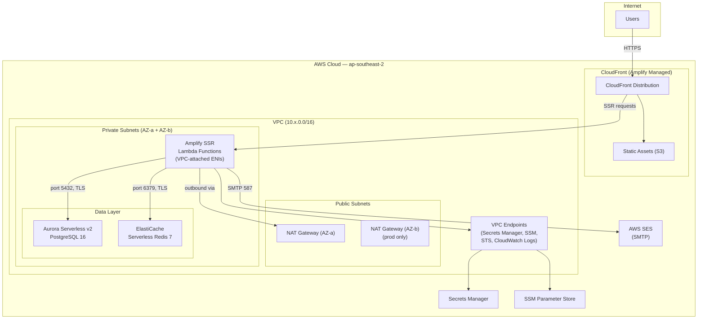
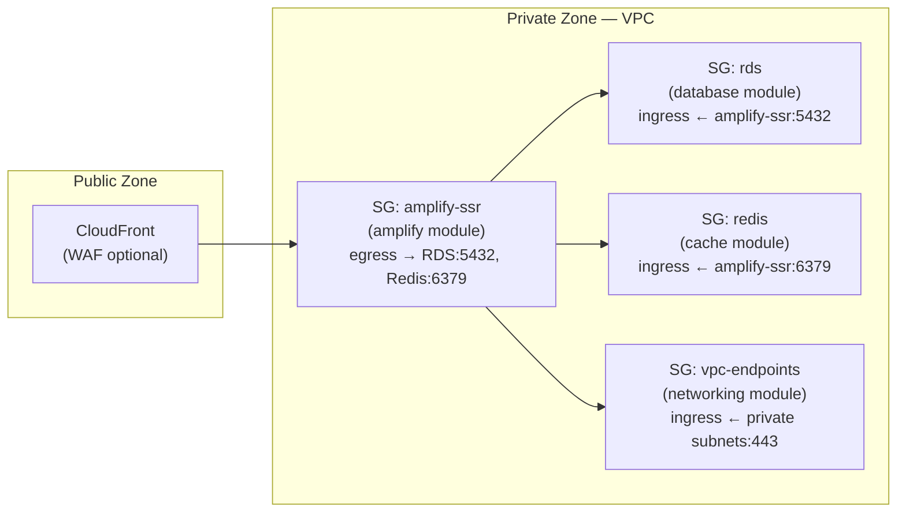

# AWS Infrastructure

This document describes the AWS infrastructure architecture for hosting the myfaves application in production and development environments.

> **Document history**
> - **2026-03-21** — Initial architecture: VPC, Aurora Serverless v2, ElastiCache Serverless, Amplify, SES, Terraform IaC
> - **2026-03-21** — Refined during implementation: security groups moved to owning modules, database credentials changed from `manage_master_user_password` to `random_password`, networking subnets/NATs switched from `count` to `for_each`, NACLs added, VPC flow logs made toggleable, consolidated all secrets from Secrets Manager to SSM Parameter Store (SecureString)

---

## Context

myfaves is a Next.js 16 SSR application that relies on PostgreSQL, Redis, and SMTP email. The local development stack uses Docker Compose (PostgreSQL 17, Redis 7, Mailhog). There is no cloud infrastructure — the application needs a production-grade AWS deployment that follows the **Well-Architected Framework** and **Zero Trust** security principles.

**Requirements:**

1. Host the Next.js SSR application with public endpoint access
2. Managed PostgreSQL database (serverless scaling)
3. Managed Redis cache (serverless or minimal instance)
4. Transactional email sending via AWS SES
5. Zero Trust security model — encrypt everything, no public database access, least-privilege IAM
6. Infrastructure as Code via Terraform with tests and security verification
7. Two environments: production and development

**Connectivity constraints from the codebase:**

| Component | Driver | Connection type | AWS implication |
|-----------|--------|----------------|-----------------|
| Database (`src/db/index.ts`) | postgres.js via Drizzle ORM | Direct TCP (port 5432) | Needs VPC connectivity to RDS |
| Cache (`src/lib/services/cache/redis-store.ts`) | ioredis | Direct TCP (port 6379) | Needs VPC connectivity to ElastiCache |
| Email (`src/lib/services/email/index.ts`) | nodemailer SMTP | SMTP over TCP (port 587) | SES SMTP endpoint — no VPC needed |
| Config (`src/lib/config/index.ts`) | Zod env validation | Environment variables | Amplify env vars + Secrets Manager |

---

## Decision

### AWS Service Selection

| Concern | Service | Rationale |
|---------|---------|-----------|
| Compute / Hosting | **AWS Amplify Gen 2** | Native Next.js SSR support, managed CI/CD, CloudFront CDN, no container management overhead |
| Database | **Aurora Serverless v2 (PostgreSQL 16)** | Scale-to-zero for dev, auto-scaling for prod, managed backups, compatible with postgres.js driver |
| Cache | **ElastiCache Serverless (Redis 7)** | True serverless — no instance sizing, auto-scales, TLS native, compatible with ioredis |
| Email | **AWS SES** | Cost-effective transactional email, SMTP interface works with existing nodemailer code unchanged |
| Secrets | **SSM Parameter Store** | `SecureString` for sensitive values (KMS-encrypted), `String` for non-sensitive config. Free at standard tier — Secrets Manager's auto-rotation is unnecessary since credentials are static strings. |
| State management | **S3 + DynamoDB** | Standard Terraform remote state with locking |
| DNS / CDN | **CloudFront (via Amplify)** | Included automatically with Amplify hosting |

### Network Topology



### VPC Design

Subnets and NAT Gateways use `for_each` keyed by availability zone name (not `count`) to ensure stable resource identity — adding or removing an AZ does not force-recreate unrelated subnets.

| Component | Production | Development |
|-----------|-----------|-------------|
| CIDR | `10.0.0.0/16` | `10.1.0.0/16` |
| Public subnets | `10.0.1.0/24` (2a), `10.0.2.0/24` (2b) | `10.1.1.0/24` (2a), `10.1.2.0/24` (2b) |
| Private subnets | `10.0.10.0/24` (2a), `10.0.11.0/24` (2b) | `10.1.10.0/24` (2a), `10.1.11.0/24` (2b) |
| AZs | ap-southeast-2a, 2b | ap-southeast-2a, 2b |
| NAT Gateways | 2 (one per AZ for HA) | 1 (cost saving) |
| Internet Gateway | 1 (AWS-managed HA across all AZs) | 1 |
| NACLs | Public + Private (explicit rules) | Public + Private (explicit rules) |
| VPC Flow Logs | Enabled (CloudWatch, toggleable) | Enabled (CloudWatch, toggleable) |

### Amplify VPC Connectivity

**Challenge:** Amplify's SSR functions run as Lambda functions. To reach RDS and ElastiCache in private subnets, they need VPC-attached ENIs. The Terraform `aws_amplify_app` resource does not expose VPC configuration — this is configured through Amplify Gen 2's backend definition.

**Solution — Hybrid Terraform + Application Config:**

1. **Terraform** provisions all infrastructure (VPC, subnets, security groups, RDS, ElastiCache) and writes resource identifiers to **SSM Parameter Store**
2. **`amplify/backend.ts`** (checked into the application repo) reads SSM parameters and configures the SSR compute to attach to the VPC's private subnets with the correct security group
3. The Amplify **IAM service role** (created by Terraform) has permissions for ENI management (`ec2:CreateNetworkInterface`, `ec2:DescribeNetworkInterfaces`, `ec2:DeleteNetworkInterface`)

This approach keeps all infrastructure in Terraform while using Amplify's native mechanism for VPC connectivity.

**Alternatives considered:**

| Alternative | Why rejected |
|------------|-------------|
| RDS Data API (HTTP-based, no VPC needed) | Requires replacing postgres.js driver with Data API driver — non-trivial code change, and rate limiting uses Redis Lua scripts which need direct TCP regardless |
| RDS Proxy with public endpoint | Violates zero-trust — database endpoint accessible from internet |
| ECS Fargate instead of Amplify | Full VPC control but significantly more operational complexity (load balancers, task definitions, service discovery); user requirement specifies Amplify |

### Security Model (Zero Trust)

**Security group ownership** — each security group is defined in the Terraform module that owns the resource it protects, not centralised in the networking module. This ensures security rules are co-located with the resources they govern and change in lockstep.

| Security Group | Owning Module | Rules |
|---|---|---|
| `amplify-ssr` | `amplify` | Egress → RDS SG:5432, Redis SG:6379, VPC endpoint SG:443, internet:443/587 |
| `rds` | `database` | Ingress ← amplify-ssr SG:5432 only |
| `redis` | `cache` | Ingress ← amplify-ssr SG:6379 only |
| `vpc-endpoints` | `networking` | Ingress ← private subnet CIDRs:443 |

Cross-module wiring: the database and cache modules accept the amplify SSR SG ID as input for their ingress rules. The amplify SSR egress rules to RDS/Redis SGs are defined as standalone resources in the **root environment module** (`environments/dev/main.tf`, `environments/prod/main.tf`) to avoid circular module dependencies — the amplify module cannot reference database/cache SG IDs without creating a cycle.



**Network ACLs** — explicit NACLs on both subnet tiers as a defence-in-depth layer above security groups:
- **Public NACL**: allows HTTP/S ingress, ephemeral return traffic, all egress
- **Private NACL**: allows VPC-internal traffic, ephemeral return traffic (NAT responses), all egress. No direct internet ingress.

**Encryption at rest:**
- RDS: AWS-managed KMS key (default `aws/rds`)
- ElastiCache: AWS-managed KMS key (default `aws/elasticache`)
- S3 state bucket: SSE-S3 with bucket key
- Secrets Manager: AWS-managed KMS key (default `aws/secretsmanager`)

**Encryption in transit:**
- RDS: TLS enforced via `rds.force_ssl` cluster parameter
- ElastiCache: TLS enforced (transit encryption enabled)
- Amplify: HTTPS only (CloudFront managed TLS)
- VPC Endpoints: HTTPS

**IAM least-privilege:**
- Amplify service role: read Secrets Manager, read SSM, manage ENIs, write CloudWatch Logs
- No wildcard (`*`) resource ARNs — all policies scoped to specific resource ARNs

**Network isolation:**
- RDS and ElastiCache in private subnets — no public IP, no internet gateway route
- Security groups reference other security groups (not CIDR blocks) for service-to-service rules
- VPC Endpoints keep AWS API calls off the public internet
- VPC Flow Logs (toggleable) capture all traffic for audit

### Secrets Strategy

**Database credentials** use `random_password` (Terraform-managed) rather than RDS `manage_master_user_password`. The RDS-managed approach stores credentials as a JSON secret (`{"username":"...","password":"..."}`) with auto-rotation — but the application reads `DATABASE_URL` as a connection string from environment variables. Auto-rotation would silently break the running app unless it was rewritten to fetch credentials at runtime. The pragmatic choice: generate the password at provision time, compose the full `DATABASE_URL` in the secrets module, and store it in SSM. Rotation is a manual operation (update password → update parameter → redeploy).

**All secrets use SSM Parameter Store** rather than Secrets Manager. The values are static strings with manual rotation — Secrets Manager's auto-rotation capability is unused, and at $0.40/secret/month it adds cost for no benefit. SSM `SecureString` parameters are KMS-encrypted and free at standard tier.

| Secret | SSM Type | Path pattern | Rotation |
|--------|----------|-------------|----------|
| `DATABASE_URL` | `SecureString` | `/{project}/{env}/database-url` | Manual |
| `REDIS_URL` | `SecureString` | `/{project}/{env}/redis-url` | Manual |
| `AUTH_SECRET` | `SecureString` | `/{project}/{env}/auth-secret` | Manual |
| SMTP credentials | `SecureString` | `/{project}/{env}/smtp-credentials` | Manual |
| `GOOGLE_PLACES_API_KEY` | `SecureString` | `/{project}/{env}/google-places-api-key` | Manual |
| `NEXT_PUBLIC_APP_URL` | `String` | `/{project}/{env}/app-url` | N/A |
| SMTP host / port / from | `String` | `/{project}/{env}/smtp-*` | N/A |
| `LOG_LEVEL` | `String` | `/{project}/{env}/log-level` | N/A |

### Environment Isolation

Production and development use **separate VPCs** provisioned by the same Terraform modules with different variable files:

```
infrastructure/
├── modules/          # Shared, reusable modules
├── environments/
│   ├── dev/          # terraform.tfvars → 10.1.0.0/16, 1 NAT, low ACU limits
│   └── prod/         # terraform.tfvars → 10.0.0.0/16, 2 NATs, higher ACU limits
```

Each environment has its own:
- VPC with distinct CIDR
- RDS cluster with environment-appropriate scaling
- ElastiCache serverless cache
- Amplify branch deployment (dev branch → dev env, main → prod)
- Secrets Manager secrets (environment-prefixed names)
- S3 state key (separate state files per environment)

### Cost Considerations

| Service | Dev (estimated monthly) | Prod (estimated monthly) | Notes |
|---------|------------------------|--------------------------|-------|
| Aurora Serverless v2 | ~$45 (0.5 ACU min) | ~$45–$200 (scales with load) | Cannot scale to 0 ACU; 0.5 is minimum |
| ElastiCache Serverless | ~$10–$20 | ~$10–$50 | Pay per ECPU + data stored |
| Amplify Hosting | ~$5–$15 | ~$10–$50 | Build minutes + request pricing |
| NAT Gateway | ~$35 (1 gateway) | ~$70 (2 gateways) | $0.045/hr + data processing |
| SES | < $1 | < $5 | $0.10 per 1K emails |
| SSM Parameter Store | Free | Free | Standard tier, KMS encryption included |
| VPC Endpoints | ~$30 (4 endpoints) | ~$30 (4 endpoints) | $0.01/hr per endpoint per AZ |
| **Total estimate** | **~$125–$145/mo** | **~$165–$405/mo** | Scales with traffic |

### Terraform Testing Strategy

1. **`terraform validate`** — Syntax and configuration validation
2. **`terraform test` (native)** — Plan-level assertions for each module:
   - Encryption enabled on all storage resources
   - No public accessibility on databases
   - Security group rules are restrictive (no `0.0.0.0/0` ingress on data ports)
   - Correct subnet placement (private for data, public for NAT)
3. **tfsec** — Static security analysis against AWS best practices
4. **checkov** — CIS AWS Foundations Benchmark compliance checks
5. **CI integration** — `terraform fmt`, `validate`, `tfsec`, `checkov` in GitHub Actions

---

## Consequences

### Positive

- **No application code changes** — existing postgres.js, ioredis, and nodemailer code works unchanged with the new infrastructure
- **Serverless scaling** — Aurora Serverless v2 and ElastiCache Serverless scale automatically, reducing operational burden
- **Zero Trust by default** — all data encrypted, all databases private, least-privilege IAM
- **Environment parity** — same Terraform modules for prod and dev, different scaling parameters
- **Cost effective** — serverless services minimize idle costs; dev environment uses single NAT Gateway

### Negative

- **Hybrid IaC** — Amplify VPC connectivity requires `amplify/backend.ts` alongside Terraform, adding a second configuration surface
- **NAT Gateway cost** — fixed cost (~$35–70/mo) regardless of traffic; alternative is NAT Instance (lower cost, more operational complexity)
- **Aurora minimum cost** — 0.5 ACU minimum means ~$45/mo even when idle; no true scale-to-zero
- **VPC Endpoint cost** — ~$30/mo for the 4 endpoints; trade-off is reduced NAT data charges and improved security posture

### Risks

| Risk | Mitigation |
|------|-----------|
| Amplify Gen 2 VPC support changes | Pin Amplify CDK version; monitor AWS release notes |
| SES sandbox limits block email in new account | Request production access early; sandbox allows verified addresses for initial testing |
| ElastiCache Serverless pricing unpredictable | Monitor ECPU consumption; set CloudWatch alarms on cost metrics |
| Terraform state corruption | S3 versioning enabled; DynamoDB locking prevents concurrent writes |
