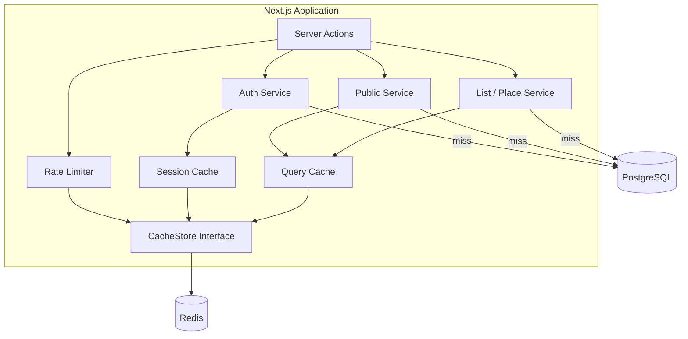
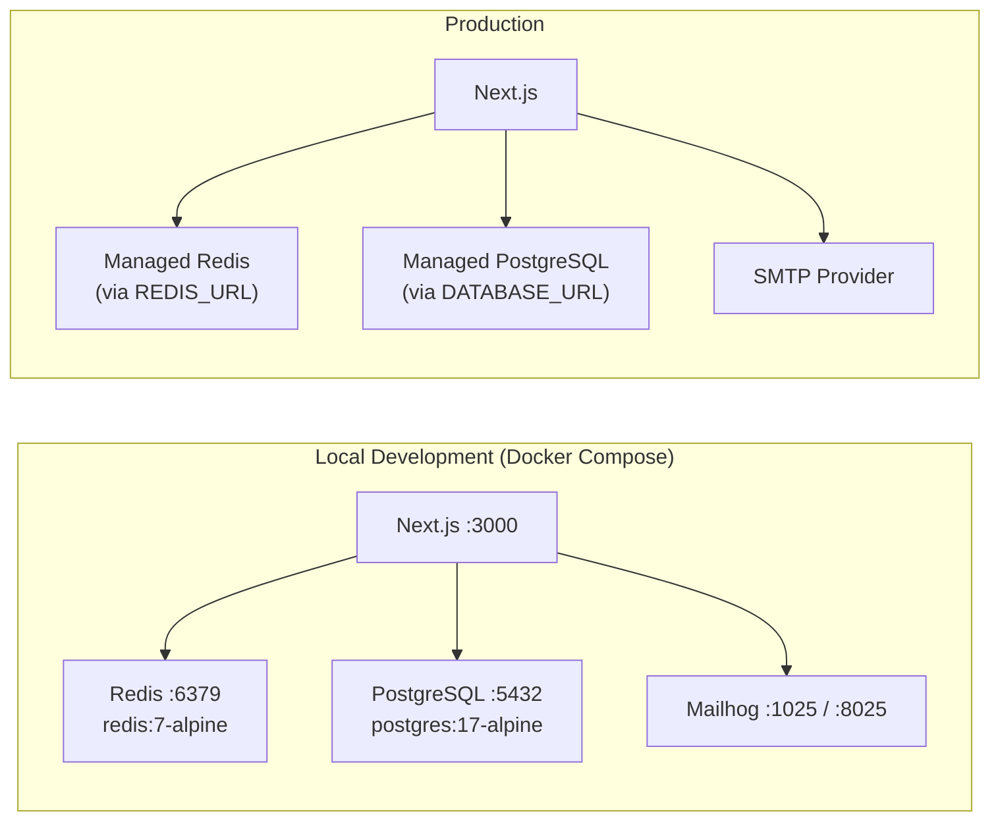
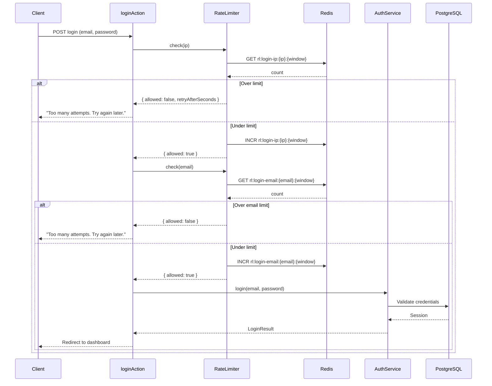
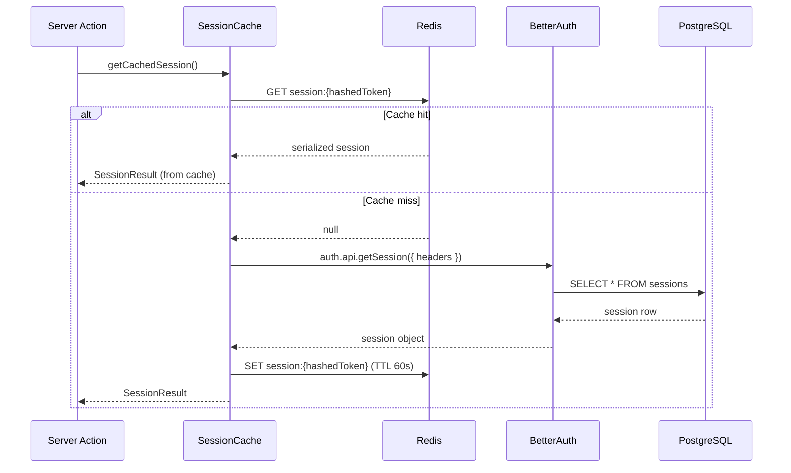
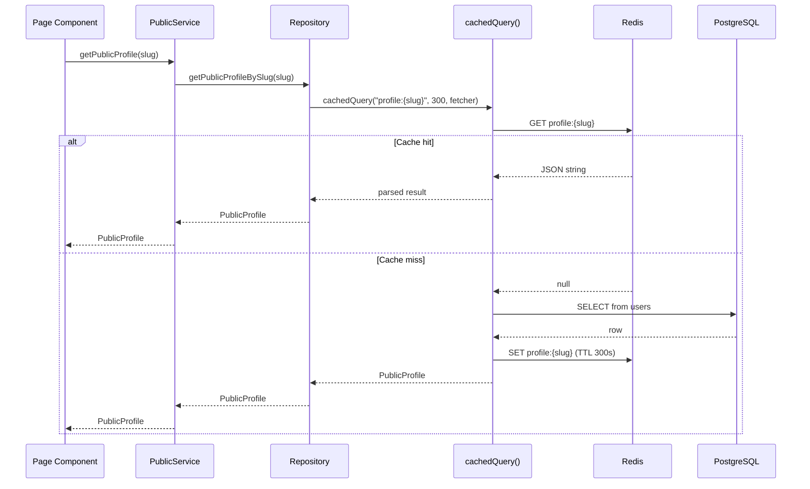

# Caching & Rate Limiting

This document describes the caching and rate limiting architecture used in the myfaves application.

> **Document history**
> - **2026-03-21** — Initial implementation: Redis-backed cache layer with sliding window rate limiting

---

## Context

myfaves has **no rate limiting** on authentication endpoints. An attacker can make unlimited password-guessing attempts against login, signup, password reset, and MFA verification. Additionally, every `getSession()` call and public page load hits PostgreSQL directly, creating unnecessary database load for data that changes infrequently.

**Problems addressed:**

1. **Brute-force vulnerability** — Login, signup, password reset, and MFA endpoints accept unlimited requests
2. **Session verification overhead** — Every server action and protected page calls `auth.api.getSession()` → DB round-trip
3. **Public page DB pressure** — Popular creator profiles and lists generate repeated identical queries

---

## Decision

Introduce a Redis-backed caching layer that provides:

1. **Rate limiting** — Sliding window counter algorithm on all auth endpoints
2. **Session caching** — Cache `getSession()` results with short TTL (~60s)
3. **DB query caching** — Cache public profiles, published lists, and place data

### Architecture



### Infrastructure Topology



### CacheStore Interface

A strategy-pattern interface decouples all consumers from the Redis implementation:

```typescript
interface CacheStore {
  get(key: string): Promise<string | null>;
  set(key: string, value: string, ttlSeconds: number): Promise<void>;
  incr(key: string): Promise<number>;
  del(key: string): Promise<void>;
  expire(key: string, ttlSeconds: number): Promise<boolean>;
  ttl(key: string): Promise<number>;
}
```

Tests mock this interface; production uses `RedisStore` backed by `ioredis`.

### Failure Mode: Fail-Open

All cache operations are wrapped in try/catch. When Redis is unavailable:

- **Rate limiting** — returns `{ allowed: true }` (requests are not blocked)
- **Session cache** — falls through to direct DB call
- **Query cache** — falls through to direct DB query

A structured warning is logged on every cache failure. This ensures Redis downtime never causes an outage.

---

## Rate-Limited Login Flow



## Session Cache Hit/Miss Flow



## DB Query Cache Flow

Caching lives in the **repository layer** — repositories are the single point of DB access, so wrapping queries there means every consumer (service, action, component) benefits transparently. Services remain unaware of whether data came from cache or DB. Repository mutation methods handle cache invalidation for the keys they own.



---

## Infrastructure

### Local Development

Redis runs alongside PostgreSQL and Mailhog in `docker-compose.yml`:

```yaml
redis:
  image: redis:7-alpine
  ports:
    - "6379:6379"
  volumes:
    - redis_data:/data
```

### Production

Connect to an external Redis instance via `REDIS_URL` environment variable. No Docker container needed in production.

### Environment Variables

| Variable | Default | Description |
|----------|---------|-------------|
| `REDIS_URL` | `redis://localhost:6379` | Redis connection string |
| `SESSION_CACHE_TTL_SECONDS` | `60` | TTL for cached session data |

---

## Rate Limit Configuration

| Endpoint | Identifier | Max Requests | Window | Key Pattern |
|----------|-----------|-------------|--------|-------------|
| Login (by IP) | IP address | 10 | 15 min | `rl:login-ip:{ip}:{window}` |
| Login (by email) | email (lowercased) | 5 | 15 min | `rl:login-email:{email}:{window}` |
| Signup | IP address | 5 | 60 min | `rl:signup:{ip}:{window}` |
| Password Reset (by IP) | IP address | 3 | 60 min | `rl:reset-ip:{ip}:{window}` |
| Password Reset (by email) | email | 3 | 60 min | `rl:reset-email:{email}:{window}` |
| MFA Send Code | session cookie | 5 | 15 min | `rl:mfa-send:{cookie}:{window}` |
| MFA Verify | session cookie | 5 | 15 min | `rl:mfa-verify:{cookie}:{window}` |
| Password Change | user ID | 5 | 60 min | `rl:password-change:{userId}:{window}` |

### Sliding Window Algorithm

Uses two adjacent fixed windows weighted by elapsed time to approximate a true sliding window:

```
currentWindowStart = floor(now / windowSize) * windowSize
previousWindowStart = currentWindowStart - windowSize
elapsedRatio = (now - currentWindowStart) / windowSize

estimatedCount = previousCount * (1 - elapsedRatio) + currentCount
```

Cache keys use the pattern `rl:{action}:{identifier}:{windowStart}` with TTL = `2 * windowSeconds` to ensure the previous window's data is available for the weighted calculation.

---

## Cache TTL Strategy

| Data Type | Key Pattern | TTL | Rationale |
|-----------|-------------|-----|-----------|
| Session | `session:{hash}` | 60s | Short TTL — security-sensitive, must reflect revocation quickly |
| Public profile | `profile:{vanitySlug}` | 5 min | Profiles change infrequently |
| Published list | `list:{userId}:{listSlug}` | 5 min | Lists change infrequently when published |
| Place | `place:{googlePlaceId}` | 30 min | Google Places data is essentially static |

Invalidation: Repository mutation methods (publish, unpublish, update, soft-delete) explicitly delete the matching cache key as part of the write operation. This keeps cache ownership co-located with data ownership in the repository layer.

---

## Alternatives Considered

### Upstash (managed Redis)
- **Pro**: Zero infrastructure management, serverless-friendly
- **Con**: External dependency for local dev, additional cost, vendor lock-in
- **Decision**: Self-hosted Redis is simpler for MVP and local development

### In-memory only (Map/LRU)
- **Pro**: No infrastructure dependency
- **Con**: Not shared across serverless instances, lost on restart, no persistence
- **Decision**: Unacceptable for rate limiting — attacker can bypass by waiting for cold start

### BetterAuth rate limiting plugin
- **Pro**: Built into auth library
- **Con**: Only covers auth endpoints managed by BetterAuth's catch-all route, not our server actions
- **Decision**: Our auth logic runs in server actions, not the catch-all route

### Token bucket algorithm
- **Pro**: Smoother rate limiting, allows bursts
- **Con**: More complex Redis operations, harder to reason about limits
- **Decision**: Sliding window counter is simpler and sufficient for auth protection

---

## Consequences

### Positive
- Brute-force protection on all auth endpoints
- Reduced DB load from session verification and public page queries
- Clear cache abstraction enables future backend changes (e.g., switching to Upstash)

### Negative
- New infrastructure dependency (Redis) — must be running for optimal performance
- Additional complexity in repository layer (cache hit/miss/invalidation logic)
- Fail-open means rate limiting is bypassed when Redis is down

### Risks
- Cache invalidation bugs could serve stale session data (mitigated by 60s TTL)
- Clock skew between servers could affect sliding window accuracy (mitigated by using Redis server time)

### New Dependencies
- `ioredis` — Robust Redis client for Node.js (MIT licensed)
- Redis 7+ server (Docker for local, managed instance for production)
