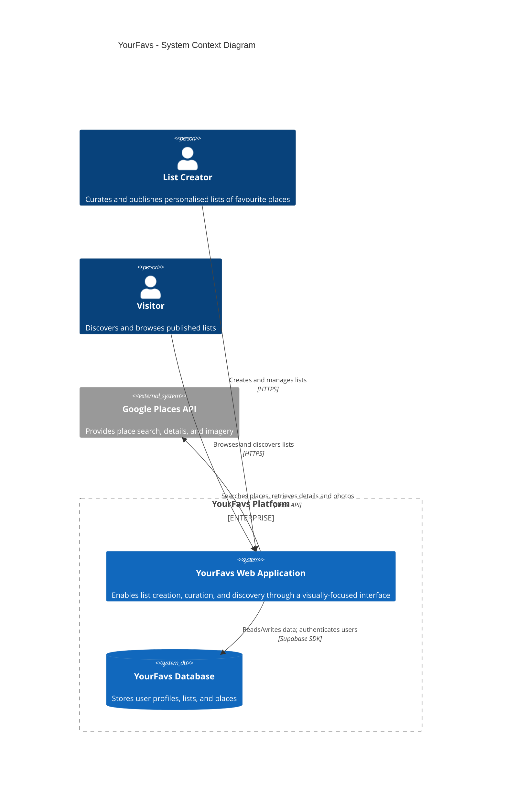
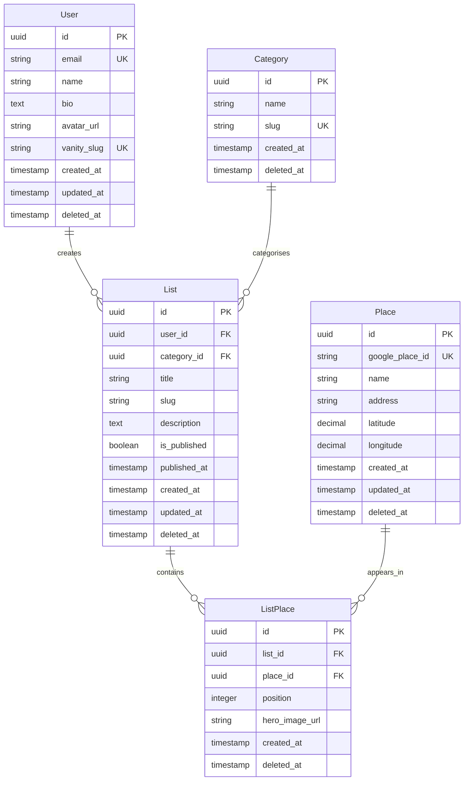

# YourFavs Platform Architecture

## Overview

YourFavs is a platform that empowers individuals to curate and share personalised collections of their favourite places. Each list is organised around a specific category—such as coffee shops, hiking trails, date-night restaurants, or weekend getaways—allowing users to build focused, meaningful lists that reflect their genuine preferences and local expertise.

The platform prioritises visual storytelling and ease of consumption. Rather than overwhelming viewers with dense information, YourFavs presents each list through a carefully designed interface that highlights compelling imagery, distills key details, and creates an intuitive browsing experience. The result is a format that feels less like a review database and more like a personal recommendation from a trusted friend.

Core to the platform is the concept of curation as expression. Users aren't just logging places they've visited—they're crafting a curated identity around taste, discovery, and place. Whether someone is a local sharing hidden gems or a traveller documenting memorable finds, YourFavs provides the canvas to showcase what matters to them in a way that's both visually appealing and immediately useful to others.

## Executive Summary

### MVP Scope

The initial release focuses on five core capabilities:

- **List Management** — Create, edit, and publish lists within predefined categories
- **Place Management** — Search and add places via Google Places, with curated imagery
- **Creator Profiles** — Personalised profiles with custom URLs for sharing
- **Discovery** — Browse lists by category or creator
- **Sharing** — Generate shareable links for any published list

### Technology Stack

The platform is built as a modern, serverless application optimised for rapid development and low operational overhead:

- **Frontend & Backend** — Next.js (App Router) deployed on Vercel
- **Database & Auth** — Supabase (Postgres + Auth)
- **ORM** — Drizzle
- **UI** — Tailwind CSS + shadcn/ui
- **Places Data** — Google Places API

### Key Design Decisions

| Decision                     | Rationale                                              |
| ---------------------------- | ------------------------------------------------------ |
| Predefined categories        | Maintain curation quality; expand based on demand      |
| Google Places imagery only   | Simplifies MVP; avoids image storage complexity        |
| Public lists only            | Reduces permissions complexity for initial release     |
| Serverless architecture      | Minimal infrastructure management for solo development |
| Supabase for auth + database | Single platform reduces integration overhead           |
| Soft deletes                 | Enables recovery and maintains referential integrity   |

### Deferred to Future Releases

- User-created categories
- Custom image uploads
- Private/unlisted list visibility
- Location-based discovery (will likely require PostGIS or Supabase geo features)
- Engagement analytics
- Social features (following, bookmarking)
- Category visual representation (icons/emoji)
- Draft mode for list editing

## Context Diagram

## Core Functionality (MVP Scope)

### List Management

- Create, edit, and delete lists
- Assign list to a predefined category
- Reorder places within a list
- Publish/unpublish lists

### Place Management

- Search and add places via Google Places integration
- Select hero image from Google Places imagery
- Remove or reorder places within a list

### Creator Profile

- Create and customise public profile (name, bio, avatar)
- View all published lists in one place
- Customise profile URL/vanity slug

### Discovery & Browsing

- Browse lists by category or creator
- View individual list pages with optimised imagery layout
- View place details within list context

### Sharing & Distribution

- Generate shareable links for lists

## Auth & Visibility

### Authentication

- Users authenticate via Supabase Auth (email/password, social providers)
- Authentication is required to create or manage lists
- No authentication required to browse or view public content

### Visibility Rules

| Content           | Visibility                                          |
| ----------------- | --------------------------------------------------- |
| Creator profiles  | Always public (even with zero published lists)      |
| Published lists   | Public, discoverable via category and creator pages |
| Unpublished lists | Visible only to the owning creator                  |
| Categories        | Public, system-defined                              |

### Account Deletion

- Soft delete: User record is marked as deleted (`deleted_at` timestamp)
- User's lists are also soft deleted
- Profile URL becomes unavailable
- Data retained for potential recovery and referential integrity

## URL Structure & Routing

| Route                                         | Description                         |
| --------------------------------------------- | ----------------------------------- |
| `/@{vanity_slug}`                             | Creator profile page                |
| `/@{vanity_slug}/{category-slug}/{list-slug}` | Individual list page                |
| `/category/{category-slug}`                   | Category browse page                |
| `/`                                           | Homepage with featured/recent lists |

### Notes

- Vanity slugs are unique per user and URL-safe
- List slugs are unique per user (not globally) and derived from list title
- Category slugs are system-defined and immutable

## Google Places Integration

### Cached Fields (MVP)

The following fields are cached locally when a place is added to a list:

- `google_place_id` — Unique identifier
- `name` — Place name
- `address` — Formatted address
- `latitude` / `longitude` — Coordinates

### Future Extensibility

The data model is designed to accommodate additional fields in future releases:

- `rating` — Google rating
- `price_level` — Price indicator
- `website` — Place website URL
- `opening_hours` — Structured hours data
- `phone_number` — Contact number

These fields can be added to the Place table without schema redesign.

### Refresh Strategy

- Place data is refreshed from Google Places API when a list containing that place is edited
- No background refresh for MVP
- Stale data is acceptable for places not actively being edited

### Quota & Error Handling

- Google Places API calls are made server-side only
- Failed API calls should not block list operations; use cached data as fallback
- Consider implementing request batching for lists with many places

## Publishing Lifecycle

### States

- **Draft** — `is_published = false`, visible only to creator
- **Published** — `is_published = true`, publicly visible

### Behaviour

- Edits to a published list go live immediately (no draft versioning for MVP)
- Unpublishing a list removes it from public discovery but retains all data
- `published_at` is set on first publish and retained even if later unpublished

### Deletion

- Lists are soft deleted (`deleted_at` timestamp)
- Soft deleted lists are excluded from all queries
- Hard deletion may be implemented later for GDPR/data retention compliance

## Data Model

### User

| Field       | Type      | Notes                                          |
| ----------- | --------- | ---------------------------------------------- |
| id          | UUID      | Primary key                                    |
| email       | String    | Unique, required                               |
| name        | String    | Display name                                   |
| bio         | Text      | Optional profile bio                           |
| avatar_url  | String    | Optional profile image URL                     |
| vanity_slug | String    | Unique, for custom profile URL (e.g., `@alex`) |
| created_at  | Timestamp |                                                |
| updated_at  | Timestamp |                                                |
| deleted_at  | Timestamp | Null if active; set on soft delete             |

### Category

| Field      | Type      | Notes                                          |
| ---------- | --------- | ---------------------------------------------- |
| id         | UUID      | Primary key                                    |
| name       | String    | Display name (e.g., "Coffee & Cafés")          |
| slug       | String    | URL-friendly identifier (e.g., `coffee-cafes`) |
| created_at | Timestamp |                                                |
| deleted_at | Timestamp | soft delete                                    |

### List

| Field        | Type      | Notes                              |
| ------------ | --------- | ---------------------------------- |
| id           | UUID      | Primary key                        |
| user_id      | UUID      | Foreign key → User                 |
| category_id  | UUID      | Foreign key → Category             |
| title        | String    | Required                           |
| slug         | String    | URL-friendly, unique per user      |
| description  | Text      | Optional                           |
| is_published | Boolean   | Default false                      |
| published_at | Timestamp | Set when first published           |
| created_at   | Timestamp |                                    |
| updated_at   | Timestamp |                                    |
| deleted_at   | Timestamp | Null if active; set on soft delete |

### Place

| Field           | Type      | Notes                          |
| --------------- | --------- | ------------------------------ |
| id              | UUID      | Primary key                    |
| google_place_id | String    | Unique, from Google Places API |
| name            | String    | Cached from Google             |
| address         | String    | Cached from Google             |
| latitude        | Decimal   | Cached from Google             |
| longitude       | Decimal   | Cached from Google             |
| created_at      | Timestamp |                                |
| updated_at      | Timestamp | Refreshed on list edit         |
| deleted_at      | Timestamp | soft delete                    |

### ListPlace

| Field          | Type      | Notes                                     |
| -------------- | --------- | ----------------------------------------- |
| id             | UUID      | Primary key                               |
| list_id        | UUID      | Foreign key → List                        |
| place_id       | UUID      | Foreign key → Place                       |
| position       | Integer   | Sort order within list                    |
| hero_image_url | String    | Selected image from Google Places imagery |
| created_at     | Timestamp |                                           |
| deleted_at     | Timestamp | soft delete                               |

### Indexes

| Table     | Index                                   | Purpose                    |
| --------- | --------------------------------------- | -------------------------- |
| User      | `vanity_slug` (unique)                  | Profile URL lookup         |
| User      | `deleted_at`                            | Exclude soft-deleted users |
| List      | `user_id, deleted_at`                   | Creator's lists query      |
| List      | `category_id, is_published, deleted_at` | Category browse page       |
| List      | `user_id, slug` (unique)                | List URL lookup            |
| Place     | `google_place_id` (unique)              | Deduplication              |
| ListPlace | `list_id, position`                     | Ordered place retrieval    |

### Entity Relationship Diagram

### Design Decisions

| Decision                      | Rationale                                                                                               |
| ----------------------------- | ------------------------------------------------------------------------------------------------------- |
| Separate Place table          | A single place can appear across multiple lists from different creators; avoids duplicating Google data |
| ListPlace junction table      | Enables ordering and per-list hero image selection for the same place                                   |
| Cached Google data on Place   | Reduces API calls; refreshed on list edit                                                               |
| hero_image_url on ListPlace   | Different creators may want to feature different images for the same place                              |
| vanity_slug on User           | Enables clean profile URLs like `yourfavs.com/@alex`                                                    |
| Soft deletes on User and List | Enables recovery, maintains referential integrity, supports future compliance needs                     |
| slug on List                  | Enables readable URLs; unique per user, not globally                                                    |

### Seed Data: Categories

| Slug             | Name                    |
| ---------------- | ----------------------- |
| coffee-cafes     | Coffee & Cafés          |
| restaurants      | Restaurants             |
| bars-nightlife   | Bars & Nightlife        |
| breakfast-brunch | Breakfast & Brunch      |
| date-night       | Date Night              |
| family-friendly  | Family-Friendly         |
| outdoor-nature   | Outdoor & Nature        |
| workspaces       | Workspaces & Co-working |

## Technology Stack

| Layer      | Choice                                      |
| ---------- | ------------------------------------------- |
| Framework  | Next.js (App Router)                        |
| Database   | Supabase (Postgres)                         |
| ORM        | Drizzle                                     |
| Auth       | Supabase Auth                               |
| Styling    | Tailwind CSS + shadcn/ui                    |
| Places API | Google Places API (New)                     |
| Testing    | Vitest + React Testing Library + Playwright |
| Linting    | ESLint + Prettier                           |
| Local Dev  | Node.js + pnpm + Supabase CLI + Docker      |
| Deployment | Vercel                                      |

### Testing Strategy

- **Unit tests (Vitest)** — Business logic, utility functions, data transformations
- **Component tests (React Testing Library)** — UI components in isolation
- **E2E tests (Playwright)** — Critical user flows (create list, add place, publish, view public list)

Priority for MVP: E2E coverage of happy paths; unit tests for complex logic.

## Non-Functional Requirements (MVP)

### Security

- All user input (bio, list title, description) is sanitised to prevent XSS
- API routes validate authentication and ownership before mutations
- Environment variables used for all secrets (Supabase keys, Google API key)
- All pages served over HTTPS
- CSRF protection for write operations.

### Rate Limiting

- Public endpoints (profile, list, category pages) are cacheable via Vercel Edge
- Consider basic rate limiting on write operations if abuse is observed

### Performance

- Queries filtered by `deleted_at IS NULL` to exclude soft-deleted records
- Indexes on frequently queried columns (see Data Model > Indexes)
- Pagination on category and creator list pages (cursor-based preferred)

### Abuse Prevention

- Vanity slug validation: alphanumeric, hyphens, minimum length
- List slug auto-generated from title with collision handling
- Future consideration: report/flag mechanism for inappropriate content

### Observability

- Basic logging and error tracking via a shared logging module.
