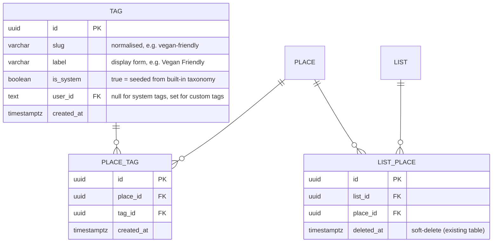

# Tags for Lists & Places

This document describes the tagging architecture for the myfaves application.

> **Document history**
> - **2026-03-22** — Initial design: shared tag vocabulary with list/place junction tables
> - **2026-03-23** — Revised: removed `list_tags` table (list tags derived via places); hard-delete semantics for `place_tags`; orphan GC for custom tags; per-user uniqueness for custom tag slugs; renamed taxonomy module

---

## Context

Creators want to classify their lists and places with short, searchable labels so that viewers can quickly understand what a list contains — for example a list tagged `cafe` + `vegan-friendly`, or a place tagged `barber` + `men`.

Two sources of tag vocabulary are required:

1. **System tags** seeded from a curated built-in taxonomy (`cafe`, `restaurant`, `bar`, …). These give creators a ready-made, consistent vocabulary.
2. **Custom tags** created on the fly by a user when the system vocabulary is insufficient (`vegan-friendly`, `date-night`, …).

Both lists and places must support **multiple** tags, and tags must be **editable** after creation (add/remove).

---

## Decision

### Data model

A single shared `tags` vocabulary table and one junction table (`place_tags`). Lists have no dedicated junction table — their tags are derived from the places they contain.

**No `list_tags` table** — List tags are derived on the fly as the `DISTINCT` union of all place tags for non-deleted places in that list (`list_places → place_tags → tags`). This avoids a separate sync step and ensures list tags always reflect actual place content.

**Shared vocabulary vs per-entity columns** — A JSON/array column on `lists`/`places` was rejected: it prevents future tag-based discovery queries (`WHERE tag = 'cafe'`), blocks a global tag autocomplete, and duplicates labels. Normalised junction tables cost one extra query per read but unlock the discovery roadmap without a migration.

**Slug normalisation** — Tag slugs are lower-cased, trimmed, and have whitespace collapsed to hyphens. `Vegan Friendly` and `vegan-friendly` resolve to the same row. The `label` column preserves the first-seen display casing. Slugs that normalise to an empty string (e.g. punctuation-only input) are rejected by both client-side `commit()` guards and the `tagLabelSchema` Zod refinement.

**System vs custom** — `is_system = true` marks seeded built-in types. These are global (`user_id IS NULL`) and are never deleted. Custom tags carry the creating user's id so future moderation can attribute them.

**Per-user uniqueness for custom tags** — Two partial unique indexes replace the former global unique constraint on `slug`:
- `UNIQUE (slug) WHERE is_system = true` — system tags are globally unique by slug.
- `UNIQUE (slug, user_id) WHERE is_system = false` — custom tags are unique per user, so two different users may independently create the same slug.

**Hard-delete semantics for `place_tags`** — Removing a tag from a place deletes the junction row immediately. There is no `deleted_at` on `place_tags` or `tags`. This diverges from the platform-wide soft-delete convention; the trade-off is simpler GC logic at the cost of no restore path (acceptable because tags are cheap to re-add).

**Custom-tag garbage collection** — When tags are removed from a place, any custom tags (`user_id IS NOT NULL`) that are no longer referenced by any `place_tags` row are hard-deleted from the `tags` table. System tags are never garbage-collected.

### Service layer

The `src/lib/tag/` module owns tag business logic, matching the existing `list/` and `place/` pattern:

| Function | Responsibility |
|----------|----------------|
| `searchTags` | Autocomplete — system tags + the user's own custom tags, prefix-matched on slug |
| `getTagsForPlace` | Read tags attached to a place |
| `getTagsForPlaces` | Batch-read tags for multiple places |
| `getTagsForListsViaPlaces` | Derive tags for multiple lists from their places' tags |
| `setPlaceTags` | Replace the full tag set on a place (diff, hard-delete removed, insert added, GC orphans) |
| `normaliseTagSlug` / `normaliseTagLabel` | Pure helpers in `src/lib/tag/helpers/slug.ts` |

`setPlaceTags` accepts a list of **labels** (not ids). Unknown labels are inserted as custom tags on the fly with `INSERT … ON CONFLICT DO NOTHING`; the full set is re-fetched afterwards to handle concurrent inserts of the same slug by the same user.

### System tag taxonomy

A curated subset of common place types is defined in `src/lib/tag/system-tags.ts` and inserted by `pnpm db:seed`. The export is `SYSTEM_TAG_TAXONOMY`. Only types a human would plausibly use as a label are included; administrative/geocoding types are excluded.

### UI

- `PlaceTagEditor` — inline client component on place cards. Renders current tags as removable `Badge` chips (× = immediate remove) and a combobox input for adding tags with debounced autocomplete. Changes are saved immediately via `setPlaceTagsAction` on each add/remove, with optimistic local state and error rollback.
- `TagInput` — standalone client component for form-based tag entry (used in settings-style forms). Emits a hidden `tags` field (JSON array of labels) consumed by server actions.
- `TagBadgeList` — server-safe display component rendering tags as `Badge` chips. Used on public list/place views.

`PlaceTagEditor` and `TagBadgeList` live in `src/components/shared/`; `PlaceTagEditor` lives in `src/components/dashboard/places/`.

---

## Consequences

- **One extra query per place render** to hydrate tags. Acceptable for MVP; can be folded into the existing `cachedQuery` layer later.
- **List tags are always consistent** with place content — no sync step can diverge.
- **No list-level tag editing** — tags are set on places, not lists. The list tag view is read-only and reflects place tags automatically.
- **No tag restore** — hard-delete means a removed tag must be re-added manually. Acceptable since tags are short free-text values.
- **Custom-tag moderation** is deferred — any authenticated user can create a tag. `user_id` on the tag row gives us attribution when moderation ships.
- **Taxonomy drift** — if the built-in taxonomy is extended, a follow-up seed run is idempotent (`INSERT … ON CONFLICT DO NOTHING` on slug).
