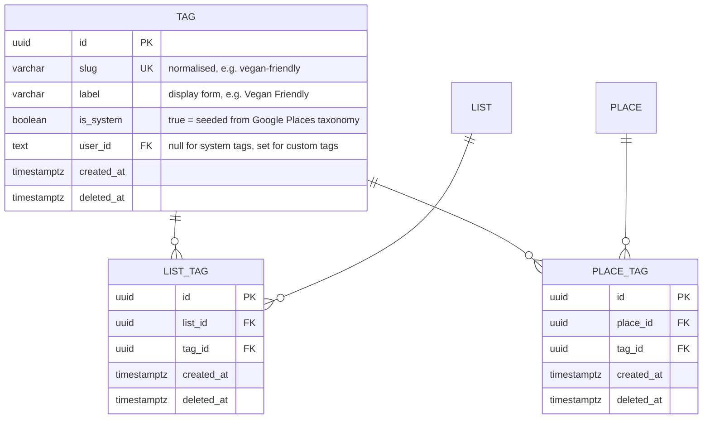

# Tags for Lists & Places

This document describes the tagging architecture for the myfaves application.

> **Document history**
> - **2026-03-22** — Initial design: shared tag vocabulary with list/place junction tables

---

## Context

Creators want to classify their lists and places with short, searchable labels so that viewers can quickly understand what a list contains — for example a list tagged `cafe` + `vegan-friendly`, or a place tagged `barber` + `men`.

Two sources of tag vocabulary are required:

1. **System tags** seeded from the Google Places *type* taxonomy (`cafe`, `restaurant`, `bar`, …). These give creators a ready-made, consistent vocabulary that aligns with the data already returned by the Places API.
2. **Custom tags** created on the fly by a user when the system vocabulary is insufficient (`vegan-friendly`, `date-night`, …).

Both lists and places must support **multiple** tags, and tags must be **editable** after creation (add/remove).

---

## Decision

### Data model

A single shared `tags` vocabulary table plus two junction tables:

**Shared vocabulary vs per-entity columns** — A JSON/array column on `lists`/`places` was rejected: it prevents future tag-based discovery queries (`WHERE tag = 'cafe'`), blocks a global tag autocomplete, and duplicates labels. Normalised junction tables cost one extra query per read but unlock the discovery roadmap without a migration.

**Slug normalisation** — Tag slugs are lower-cased, trimmed, and have whitespace collapsed to hyphens. `Vegan Friendly` and `vegan-friendly` resolve to the same row. The `label` column preserves the first-seen display casing.

**System vs custom** — `is_system = true` marks seeded Google Places types. These are global (`user_id IS NULL`) and never soft-deleted. Custom tags carry the creating user's id so future moderation can attribute them.

**Soft deletes** — Junction rows follow the platform-wide soft-delete convention. Removing a tag from a list sets `list_tags.deleted_at`; re-adding restores the row in place (mirrors `list_places` behaviour).

### Service layer

A new `src/lib/tag/` module owns tag business logic, matching the existing `list/` and `place/` pattern:

| Function | Responsibility |
|----------|----------------|
| `searchTags` | Autocomplete — system tags + the user's own custom tags, prefix-matched on slug |
| `getTagsForList` / `getTagsForPlace` | Read tags attached to an entity |
| `setListTags` / `setPlaceTags` | Replace the full tag set on an entity (diff against current, add/remove/restore) |
| `normaliseTagSlug` | Pure helper used by both service and validation |

`setXxxTags` accepts a list of **labels** (not ids). Unknown labels are inserted as custom tags on the fly, known labels are reused — the caller never needs to know whether a tag already exists.

### Google Places taxonomy

A curated subset (~50) of Google's Table-A place types is defined in `src/lib/tag/google-places-taxonomy.ts` and inserted by `pnpm db:seed`. The full Google list (~100+ types) includes many irrelevant entries (`administrative_area_level_3`, `plus_code`); we ship only types a human would plausibly use as a label.

### UI

- `TagInput` — client component wrapping a text input + suggestion popover + selected-tag chips. Emits a hidden `tags` form field (JSON array of labels) consumed by server actions.
- `TagBadgeList` — server-safe display component rendering tags as `Badge` chips. Used on dashboard cards and public views.

Both live in `src/components/shared/` since they are consumed by dashboard **and** public routes.

---

## Consequences

- **One extra query per list/place render** to hydrate tags. Acceptable for MVP; can be folded into the existing `cachedQuery` layer later.
- **Tag discovery is unblocked** — `SELECT … FROM list_tags JOIN tags WHERE slug = ?` is now trivial.
- **Custom-tag moderation** is deferred — any authenticated user can create a tag. `user_id` on the tag row gives us attribution when moderation ships.
- **Google taxonomy drift** — if Google adds/renames types, a follow-up seed run is idempotent (upsert on slug).
