# Phase 1: Data Model & Component Architecture

**Feature**: Dashboard Foundation  
**Date**: 2025-12-06  
**Status**: Complete

## Overview

The Dashboard Foundation feature is primarily UI-focused with minimal state management. This document outlines the component architecture, state model, and data flows.

---

## Component Entities

### 1. DashboardSidebar

**Purpose**: Reusable navigation content component used in both desktop fixed sidebar and mobile drawer.

**Type**: React Server Component (can be server component since it's presentational)

**State**: None (stateless, presentational)

**Props Interface**:
```typescript
// No props - purely presentational component
interface DashboardSidebarProps {}
```

**Structure**:
```typescript
export function DashboardSidebar() {
  return (
    <div className="flex flex-col h-full">
      {/* Logo/Branding */}
      <div className="p-6 border-b">
        <h1 className="text-xl font-semibold">📍 YourFavs</h1>
      </div>
      
      {/* Navigation Container */}
      <nav className="flex-1 p-4">
        {/* Future: Navigation items will be added here */}
        <div className="text-muted-foreground text-sm">
          Navigation items coming soon
        </div>
      </nav>
    </div>
  );
}
```

**Validation Rules**: None (no user input)

**State Transitions**: None (stateless)

---

### 2. DashboardContent

**Purpose**: Main content area wrapper that applies responsive margin to offset sidebar on desktop.

**Type**: React Server Component (can be server component - wraps children)

**State**: None (stateless wrapper)

**Props Interface**:
```typescript
import type { ReactNode } from 'react';

interface DashboardContentProps {
  children: ReactNode;
}
```

**Structure**:
```typescript
export function DashboardContent({ children }: DashboardContentProps) {
  return (
    <main className="min-h-screen lg:ml-64">
      <div className="p-6">
        {children}
      </div>
    </main>
  );
}
```

**Responsive Behavior**:
- Mobile (<1024px): Full width (`ml-0`)
- Desktop (≥1024px): Left margin of 256px (`lg:ml-64`) to offset sidebar

**Validation Rules**: 
- `children` must be valid React nodes (enforced by TypeScript)

**State Transitions**: None (stateless)

---

### 3. DashboardPage (page.tsx)

**Purpose**: Client component orchestrating dashboard layout, session monitoring, and mobile drawer state.

**Type**: React Client Component (`'use client'`)

**State Management**:

```typescript
interface DashboardPageState {
  isDrawerOpen: boolean;  // Mobile drawer visibility
}
```

**State Transitions**:



```mermaid
graph LR
    A[Drawer Closed] -->|User taps hamburger| B[Drawer Open]
    B -->|User taps close button| A
    B -->|User taps outside drawer| A
    B -->|Viewport resizes to ≥1024px| A
```

**Session State Flow**:


**Props Interface**: None (page component)

**Structure**:
```typescript
'use client';

import { useEffect, useState } from 'react';
import { useRouter } from 'next/navigation';
import { createClient } from '@/lib/supabase/client';
import { DashboardSidebar } from '@/components/dashboard/DashboardSidebar';
import { DashboardContent } from '@/components/dashboard/DashboardContent';
import { Sheet, SheetContent, SheetTrigger } from '@/components/ui/sheet';
import { Button } from '@/components/ui/button';
import { Menu } from 'lucide-react';

export default function DashboardPage() {
  const [isDrawerOpen, setIsDrawerOpen] = useState(false);
  const router = useRouter();
  const supabase = createClient();

  // Session monitoring
  useEffect(() => {
    const { data: { subscription } } = supabase.auth.onAuthStateChange(
      (event, session) => {
        if (event === 'SIGNED_OUT' || !session) {
          router.push('/login');
        }
      }
    );

    return () => subscription.unsubscribe();
  }, [supabase, router]);

  return (
    <div className="flex min-h-screen">
      {/* Desktop Sidebar */}
      <aside className="hidden lg:block fixed left-0 top-0 h-screen w-64 border-r bg-background">
        <DashboardSidebar />
      </aside>

      {/* Mobile Navigation */}
      <nav className="lg:hidden fixed top-0 left-0 right-0 z-50 bg-background border-b">
        <div className="p-4">
          <Sheet open={isDrawerOpen} onOpenChange={setIsDrawerOpen}>
            <SheetTrigger asChild>
              <Button variant="ghost" size="icon" aria-label="Open navigation menu">
                <Menu className="h-6 w-6" />
              </Button>
            </SheetTrigger>
            <SheetContent side="left" className="w-64 p-0">
              <DashboardSidebar />
            </SheetContent>
          </Sheet>
        </div>
      </nav>

      {/* Main Content */}
      <DashboardContent>
        <div className="mt-16 lg:mt-0">
          <h2 className="text-2xl font-semibold mb-4">Dashboard</h2>
          <p className="text-muted-foreground">
            Welcome to your dashboard. Features coming soon.
          </p>
        </div>
      </DashboardContent>
    </div>
  );
}
```

**Validation Rules**:
- Session monitoring must run on mount (useEffect dependency array)
- Drawer state must be boolean
- Auth state listener must be cleaned up on unmount

**State Lifecycle**:
1. **Mount**: Subscribe to Supabase auth state changes
2. **Active**: Monitor for SIGNED_OUT or null session
3. **Auth Change**: If logged out, redirect to /login
4. **Unmount**: Unsubscribe from auth listener

---

## Session Entity

**Purpose**: Represents authenticated user session managed by Supabase Auth.

**Source**: Supabase Auth (external to component state)

**Fields**:
```typescript
// Managed by Supabase - not directly stored in component
interface Session {
  access_token: string;
  refresh_token: string;
  expires_at: number;
  expires_in: number;
  user: {
    id: string;
    email: string;
    // ... other user metadata
  };
}
```

**State Transitions**:


**Validation Rules**:
- Session must have valid access_token (validated by Supabase)
- expires_at must be in the future (validated by Supabase)
- User must exist (enforced by server-side layout.tsx)

---

## Drawer State Entity

**Purpose**: Tracks mobile navigation drawer visibility.

**Scope**: Local to DashboardPage component

**Type**: Boolean

**State Transitions**:
```typescript
type DrawerState = boolean;

// Transitions
const openDrawer = () => setIsDrawerOpen(true);
const closeDrawer = () => setIsDrawerOpen(false);
const toggleDrawer = () => setIsDrawerOpen(prev => !prev);

// Automatic transitions
// - shadcn Sheet handles close on outside click
// - shadcn Sheet handles close on ESC key
// - CSS media query hides drawer UI on viewport resize
```

**Validation Rules**: 
- Must be boolean (enforced by TypeScript)
- Controlled by Sheet component's `onOpenChange` callback

---

## Responsive Layout State

**Purpose**: Control sidebar/drawer visibility based on viewport width.

**Managed By**: CSS media queries (not React state)

**Breakpoint**: `1024px` (Tailwind `lg` breakpoint)

**Behavior**:
```css
/* Mobile (<1024px) */
aside.sidebar { display: none; }
nav.mobile-header { display: block; }

/* Desktop (≥1024px) */
aside.sidebar { display: block; }
nav.mobile-header { display: none; }
```

**State Transitions**: Automatic via CSS (no JavaScript state)

**Validation Rules**: None (CSS-driven)

---

## Data Flow Diagrams

### Authentication Flow


### Mobile Drawer Interaction Flow


### Responsive Layout Flow


---

## Component Relationships


---

## Future State Considerations

### Navigation Items (Future Enhancement)

When navigation items are added to DashboardSidebar:

```typescript
interface NavigationItem {
  id: string;
  label: string;
  href: string;
  icon: LucideIcon;
  active?: boolean;
}

interface DashboardSidebarProps {
  items?: NavigationItem[];  // Optional for backward compatibility
}
```

**State Transitions**:
- Active item tracking (controlled by router pathname)
- Click → navigation → active state update

**Validation Rules**:
- Each item must have unique id
- href must be valid route
- icon must be valid Lucide component

### User Profile Data (Future Enhancement)

When user profile display is added:

```typescript
interface UserProfile {
  id: string;
  email: string;
  display_name?: string;
  avatar_url?: string;
}

// Fetched via Supabase client
const { data: profile } = await supabase
  .from('profiles')
  .select('*')
  .eq('id', user.id)
  .single();
```

**Integration Point**: DashboardSidebar footer section

---

## Performance Characteristics

### State Update Frequency

| State | Update Frequency | Trigger |
|-------|------------------|---------|
| `isDrawerOpen` | User-initiated (~0.1-1 Hz) | Button clicks |
| Session | Event-driven (rare) | Auth state changes |
| Responsive layout | CSS-driven (no state) | Viewport resize |

### Re-render Optimization

- **DashboardSidebar**: No props changes → no re-renders (memoizable)
- **DashboardContent**: Children change → controlled re-renders
- **DashboardPage**: Drawer state isolated → minimal re-renders

### Memory Footprint

- Session listener: ~1KB (single subscription)
- Drawer state: <1KB (boolean)
- Component tree: ~5-10KB (minimal DOM)

**Total**: <15KB runtime overhead

---

## Constraints & Invariants

### Invariants

1. **Auth Protection**: User MUST be authenticated to render dashboard (enforced by layout.tsx)
2. **Session Monitoring**: Auth listener MUST be cleaned up on unmount (prevents memory leaks)
3. **Sidebar Content**: DashboardSidebar MUST be identical in desktop and mobile contexts
4. **Semantic Structure**: nav, aside, main elements MUST be used correctly

### Constraints

1. **Responsive Breakpoint**: Fixed at 1024px (Tailwind lg)
2. **Sidebar Width**: Fixed at 256px (w-64)
3. **Animation Duration**: <300ms (Sheet default, meets SC-003)
4. **Redirect Target**: Always `/login` (hardcoded, matches existing auth flow)

---

## Phase 1 Completion Checklist

- [x] Component entities defined (DashboardSidebar, DashboardContent, DashboardPage)
- [x] State model documented (drawer state, session state)
- [x] Props interfaces specified (TypeScript types)
- [x] State transitions mapped (Mermaid diagrams)
- [x] Data flows documented (authentication, drawer, responsive)
- [x] Component relationships illustrated
- [x] Validation rules established
- [x] Performance characteristics analyzed
- [x] Future extensibility considered
- [x] Constraints and invariants documented

**Status**: ✅ Ready for contracts generation and quickstart guide
