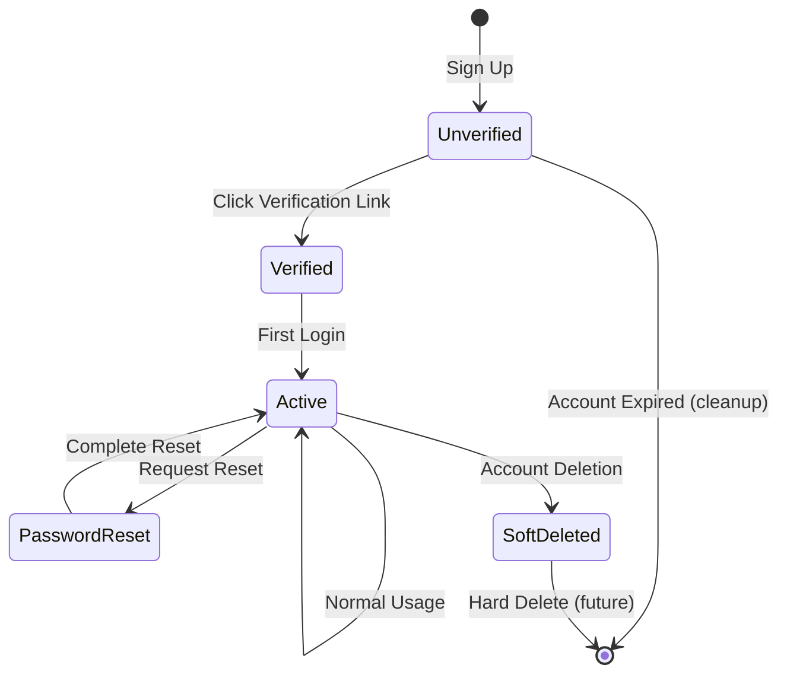
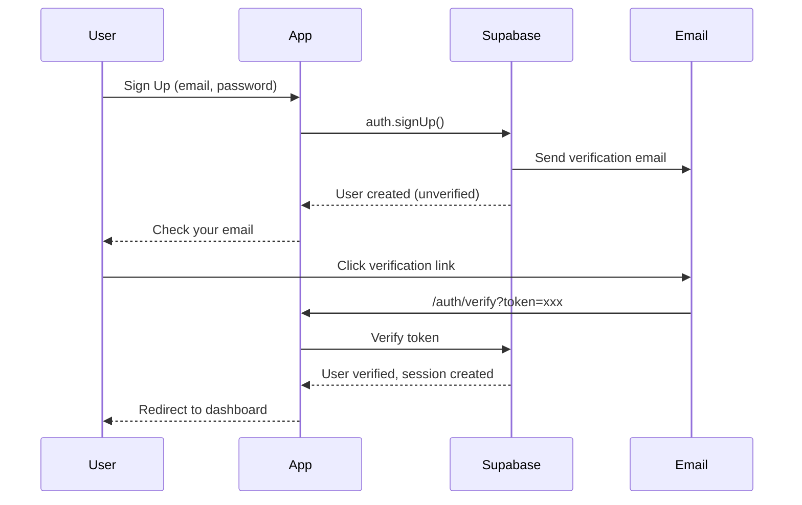

# Data Model: Database Schema & Supabase Auth Configuration

**Feature**: Task 1.2 - Database Schema & Supabase Auth Configuration  
**Date**: 2025-11-29  
**Status**: Complete

## Overview

This document defines the database schema extensions, Row Level Security (RLS) policies, and related configurations for the authentication system.

---

## Security Considerations

### Column-Level Access Control

RLS policies in PostgreSQL operate at the row level, not the column level. The `users_select_public` policy allows access to all columns for non-deleted users. To protect sensitive data like email addresses:

1. **Application Layer Enforcement**: API routes and server components MUST explicitly select only public fields when returning user data to non-owners.
2. **Public Fields**: `id`, `name`, `bio`, `avatar_url`, `vanity_slug`, `created_at`
3. **Private Fields**: `email`, `updated_at`, `deleted_at`

**Future Enhancement**: Consider creating a `public_users` view that only exposes public fields, or implementing column-level masking using PostgreSQL functions.

---

## Entity: Users (Extended)

The `users` table already exists in the Drizzle schema. This section documents the RLS policies to be applied.

### Existing Schema Reference

```sql
-- From src/db/schema/user.ts (Drizzle)
CREATE TABLE users (
  id UUID PRIMARY KEY DEFAULT gen_random_uuid(),
  email VARCHAR(255) NOT NULL UNIQUE,
  name VARCHAR(255) NOT NULL,
  bio TEXT,
  avatar_url VARCHAR(2048),
  vanity_slug VARCHAR(50) NOT NULL UNIQUE,
  created_at TIMESTAMPTZ NOT NULL DEFAULT now(),
  updated_at TIMESTAMPTZ NOT NULL DEFAULT now(),
  deleted_at TIMESTAMPTZ
);

-- Existing indexes
CREATE UNIQUE INDEX users_vanity_slug_idx ON users(vanity_slug);
CREATE INDEX users_deleted_at_idx ON users(deleted_at);
```

### Foreign Key Relationship

```sql
-- Link to Supabase Auth users
ALTER TABLE users
ADD CONSTRAINT users_id_fkey
FOREIGN KEY (id) REFERENCES auth.users(id)
ON DELETE CASCADE;
```

### Row Level Security Policies

| Policy Name           | Operation | Target                     | Condition                |
| --------------------- | --------- | -------------------------- | ------------------------ |
| `users_select_own`    | SELECT    | Authenticated users        | `auth.uid() = id`        |
| `users_select_public` | SELECT    | All (anon + authenticated) | `deleted_at IS NULL`     |
| `users_update_own`    | UPDATE    | Authenticated users        | `auth.uid() = id`        |
| `users_insert_own`    | INSERT    | Authenticated users        | `auth.uid() = id`        |
| `users_delete_none`   | DELETE    | None                       | Hard deletes not allowed |

**Policy SQL Definitions**:

```sql
-- Enable RLS on users table
ALTER TABLE users ENABLE ROW LEVEL SECURITY;

-- Allow users to select their own full profile
CREATE POLICY users_select_own ON users
  FOR SELECT
  TO authenticated
  USING (auth.uid() = id);

-- Allow anyone to view public profile information (non-deleted users)
-- SECURITY NOTE: This policy allows SELECT on all columns. The application layer
-- MUST control which fields are exposed in API responses. For public profiles,
-- only expose: id, name, bio, avatar_url, vanity_slug.
-- DO NOT expose: email (private data).
-- Consider using a database VIEW for public profile data in future iterations.
CREATE POLICY users_select_public ON users
  FOR SELECT
  TO anon, authenticated
  USING (deleted_at IS NULL);

-- Allow users to update only their own profile
CREATE POLICY users_update_own ON users
  FOR UPDATE
  TO authenticated
  USING (auth.uid() = id)
  WITH CHECK (auth.uid() = id);

-- Allow users to insert their own profile (id must match auth.uid())
CREATE POLICY users_insert_own ON users
  FOR INSERT
  TO authenticated
  WITH CHECK (auth.uid() = id);

-- No DELETE policy - use soft deletes via UPDATE
-- Hard deletes are prevented by lack of DELETE policy
```

---

## Entity: Lists (RLS Policies)

The `lists` table requires RLS policies for ownership-based access.

### Row Level Security Policies

| Policy Name              | Operation | Target                      | Condition                                       |
| ------------------------ | --------- | --------------------------- | ----------------------------------------------- |
| `lists_select_own`       | SELECT    | Authenticated users (owner) | `auth.uid() = user_id`                          |
| `lists_select_published` | SELECT    | All (anon + authenticated)  | `is_published = true AND deleted_at IS NULL`    |
| `lists_insert_own`       | INSERT    | Authenticated users         | `auth.uid() = user_id`                          |
| `lists_update_own`       | UPDATE    | Authenticated users         | `auth.uid() = user_id`                          |
| `lists_delete_own`       | DELETE    | Authenticated users         | `auth.uid() = user_id` (soft delete via UPDATE) |

**Policy SQL Definitions**:

```sql
-- Enable RLS on lists table
ALTER TABLE lists ENABLE ROW LEVEL SECURITY;

-- Allow users to select their own lists (including unpublished)
CREATE POLICY lists_select_own ON lists
  FOR SELECT
  TO authenticated
  USING (auth.uid() = user_id AND deleted_at IS NULL);

-- Allow anyone to view published lists
CREATE POLICY lists_select_published ON lists
  FOR SELECT
  TO anon, authenticated
  USING (is_published = true AND deleted_at IS NULL);

-- Allow users to insert their own lists
CREATE POLICY lists_insert_own ON lists
  FOR INSERT
  TO authenticated
  WITH CHECK (auth.uid() = user_id);

-- Allow users to update their own lists
CREATE POLICY lists_update_own ON lists
  FOR UPDATE
  TO authenticated
  USING (auth.uid() = user_id AND deleted_at IS NULL)
  WITH CHECK (auth.uid() = user_id);
```

---

## Entity: Places (RLS Policies)

Places are shared resources (same place can appear in multiple lists).

### Row Level Security Policies

| Policy Name                   | Operation | Target              | Condition                          |
| ----------------------------- | --------- | ------------------- | ---------------------------------- |
| `places_select_all`           | SELECT    | All                 | `deleted_at IS NULL`               |
| `places_insert_authenticated` | INSERT    | Authenticated users | Always allowed                     |
| `places_update_authenticated` | UPDATE    | Authenticated users | Always allowed (for cache refresh) |

**Policy SQL Definitions**:

```sql
-- Enable RLS on places table
ALTER TABLE places ENABLE ROW LEVEL SECURITY;

-- Allow anyone to view places (they're public reference data)
CREATE POLICY places_select_all ON places
  FOR SELECT
  TO anon, authenticated
  USING (deleted_at IS NULL);

-- Allow authenticated users to insert places
CREATE POLICY places_insert_authenticated ON places
  FOR INSERT
  TO authenticated
  WITH CHECK (true);

-- Allow authenticated users to update places (for refreshing Google Places data)
CREATE POLICY places_update_authenticated ON places
  FOR UPDATE
  TO authenticated
  USING (deleted_at IS NULL)
  WITH CHECK (true);
```

---

## Entity: ListPlaces (RLS Policies)

Junction table linking lists to places.

### Row Level Security Policies

| Policy Name                   | Operation | Target     | Condition                  |
| ----------------------------- | --------- | ---------- | -------------------------- |
| `list_places_select_via_list` | SELECT    | All        | Based on list visibility   |
| `list_places_insert_owner`    | INSERT    | List owner | `auth.uid()` owns the list |
| `list_places_update_owner`    | UPDATE    | List owner | `auth.uid()` owns the list |
| `list_places_delete_owner`    | DELETE    | List owner | `auth.uid()` owns the list |

**Policy SQL Definitions**:

```sql
-- Enable RLS on list_places table
ALTER TABLE list_places ENABLE ROW LEVEL SECURITY;

-- Allow viewing list_places if the associated list is viewable
CREATE POLICY list_places_select_via_list ON list_places
  FOR SELECT
  TO anon, authenticated
  USING (
    EXISTS (
      SELECT 1 FROM lists
      WHERE lists.id = list_places.list_id
      AND lists.deleted_at IS NULL
      AND (
        lists.is_published = true
        OR (auth.uid() IS NOT NULL AND lists.user_id = auth.uid())
      )
    )
    AND list_places.deleted_at IS NULL
  );

-- Allow list owners to insert into their lists
CREATE POLICY list_places_insert_owner ON list_places
  FOR INSERT
  TO authenticated
  WITH CHECK (
    EXISTS (
      SELECT 1 FROM lists
      WHERE lists.id = list_places.list_id
      AND lists.user_id = auth.uid()
      AND lists.deleted_at IS NULL
    )
  );

-- Allow list owners to update their list_places
CREATE POLICY list_places_update_owner ON list_places
  FOR UPDATE
  TO authenticated
  USING (
    EXISTS (
      SELECT 1 FROM lists
      WHERE lists.id = list_places.list_id
      AND lists.user_id = auth.uid()
    )
    AND list_places.deleted_at IS NULL
  )
  WITH CHECK (
    EXISTS (
      SELECT 1 FROM lists
      WHERE lists.id = list_places.list_id
      AND lists.user_id = auth.uid()
    )
  );

-- Allow list owners to delete (soft delete) from their lists
CREATE POLICY list_places_delete_owner ON list_places
  FOR DELETE
  TO authenticated
  USING (
    EXISTS (
      SELECT 1 FROM lists
      WHERE lists.id = list_places.list_id
      AND lists.user_id = auth.uid()
    )
  );
```

---

## Configuration: Supabase Auth Settings

### config.toml Changes

```toml
[auth]
# Passwords shorter than this value will be rejected as weak. Minimum 6, recommended 8 or more.
minimum_password_length = 12

# Passwords that do not meet the following requirements will be rejected as weak.
password_requirements = "lower_upper_letters_digits_symbols"

[auth.email]
# If enabled, users need to confirm their email address before signing in.
enable_confirmations = true
```

### Full Auth Section Reference

```toml
[auth]
enabled = true
site_url = "http://127.0.0.1:3000"
additional_redirect_urls = ["https://127.0.0.1:3000"]
jwt_expiry = 3600
enable_refresh_token_rotation = true
refresh_token_reuse_interval = 10
enable_signup = true
enable_anonymous_sign_ins = false
enable_manual_linking = false
minimum_password_length = 12
password_requirements = "lower_upper_letters_digits_symbols"

[auth.email]
enable_signup = true
double_confirm_changes = true
enable_confirmations = true
secure_password_change = false
max_frequency = "1s"
otp_length = 6
otp_expiry = 3600
```

---

## Configuration: Email Templates

### Template: confirmation.html (Email Verification)

**Variables Used**:

- `{{ .ConfirmationURL }}` - Link to verify email
- `{{ .SiteURL }}` - Application base URL

**Content Requirements**:

- Clear subject line: "Verify your YourFavs account"
- Prominent CTA button
- Responsive design
- Plain text alternative

### Template: recovery.html (Password Reset)

**Variables Used**:

- `{{ .ConfirmationURL }}` - Link to reset password
- `{{ .SiteURL }}` - Application base URL

**Content Requirements**:

- Clear subject line: "Reset your YourFavs password"
- Expiry notice (link valid for 1 hour)
- Prominent CTA button
- Responsive design
- Plain text alternative

---

## Validation Rules

### Password Validation

| Rule           | Requirement           | Error Message                                          |
| -------------- | --------------------- | ------------------------------------------------------ |
| Minimum Length | ≥ 12 characters       | "Password must be at least 12 characters"              |
| Lowercase      | ≥ 1 lowercase letter  | "Password must contain at least one lowercase letter"  |
| Uppercase      | ≥ 1 uppercase letter  | "Password must contain at least one uppercase letter"  |
| Digit          | ≥ 1 number            | "Password must contain at least one number"            |
| Symbol         | ≥ 1 special character | "Password must contain at least one special character" |

### Validation Utility Interface

```typescript
interface PasswordValidationResult {
  isValid: boolean;
  errors: string[];
  strength: "weak" | "medium" | "strong";
  checks: {
    minLength: boolean;
    hasLowercase: boolean;
    hasUppercase: boolean;
    hasDigit: boolean;
    hasSymbol: boolean;
  };
}

function validatePassword(password: string): PasswordValidationResult;
```

---

## State Transitions

### User Account States



### Email Verification Flow



---

## Migration File Structure

### 001_initial_auth_setup.sql

```sql
-- Migration: 001_initial_auth_setup.sql
-- Description: Configure RLS policies and link users table to Supabase Auth
-- Date: 2025-11-29

-- Enable RLS on all tables
ALTER TABLE users ENABLE ROW LEVEL SECURITY;
ALTER TABLE lists ENABLE ROW LEVEL SECURITY;
ALTER TABLE places ENABLE ROW LEVEL SECURITY;
ALTER TABLE list_places ENABLE ROW LEVEL SECURITY;

-- Users table policies
-- [Full policy definitions as documented above]

-- Lists table policies
-- [Full policy definitions as documented above]

-- Places table policies
-- [Full policy definitions as documented above]

-- ListPlaces table policies
-- [Full policy definitions as documented above]

-- Foreign key constraint to auth.users
ALTER TABLE users
ADD CONSTRAINT users_id_fkey
FOREIGN KEY (id) REFERENCES auth.users(id)
ON DELETE CASCADE;
```

---

## Indexes for RLS Performance

Existing indexes support RLS policy evaluation:

| Table       | Index                          | Purpose                   |
| ----------- | ------------------------------ | ------------------------- |
| users       | `users_pkey` (id)              | `auth.uid() = id` lookups |
| users       | `users_deleted_at_idx`         | Soft delete filtering     |
| lists       | `lists_pkey` (id)              | Primary key lookups       |
| lists       | `lists_user_id_deleted_at_idx` | User's lists queries      |
| places      | `places_pkey` (id)             | Primary key lookups       |
| list_places | `list_places_list_id_idx`      | List membership queries   |

No additional indexes required for RLS policies.
