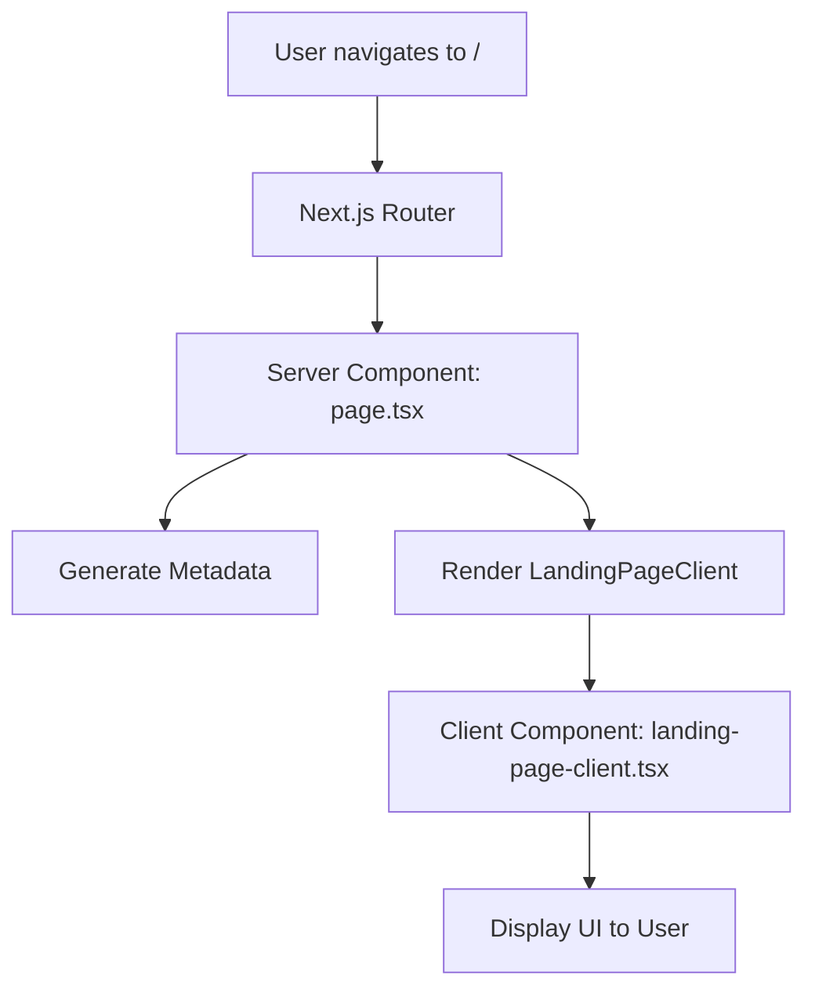

# Component Contract: Landing Page

**Component**: Landing Page (Server + Client)  
**Date**: 2025-12-05  
**Version**: 1.0.0

## Overview

The Landing Page is the entry point to the YourFavs application, accessible at the root URL (`/`). It consists of a Server Component that renders the page shell and a Client Component wrapper that provides the foundation for future interactive features.

---

## Server Component

### Location
`src/app/page.tsx`

### Responsibility
- Render the landing page route
- Generate SEO metadata
- Serve as the server-side entry point
- Delegate rendering to the Client Component

### Interface

```typescript
export default function LandingPage(): JSX.Element
```

### Metadata Export

```typescript
import type { Metadata } from 'next'

export const metadata: Metadata = {
  title: 'YourFavs - Curate and share your favorite places',
  description: 'Discover and share curated lists of your favorite coffee shops, restaurants, bars, and more.',
  openGraph: {
    title: 'YourFavs',
    description: 'Curate and share your favorite places',
    type: 'website',
  },
}
```

### Behavior
- ✅ Renders the `LandingPageClient` component
- ✅ Provides static metadata for SEO
- ✅ Server-side rendering (no client-side JavaScript required for initial render)
- ✅ No props accepted (static page)

### Error Handling
- Relies on Next.js error boundaries
- No custom error handling required (static content)

### Performance Requirements
- Initial render: < 2 seconds on standard broadband
- First Contentful Paint: < 1.5 seconds
- Zero hydration errors

---

## Client Component

### Location
`src/app/_components/landing-page-client.tsx`

### Responsibility
- Render the landing page UI
- Provide wrapper for future client-side interactivity
- Maintain visual consistency with design system

### Interface

```typescript
'use client'

export default function LandingPageClient(): JSX.Element
```

### Props
**None** - Component is self-contained with static content

### Return Value
```typescript
JSX.Element
```

Returns a React element containing:
- Centered layout container
- Main content area with semantic `<main>` element
- Application branding (h1)
- Tagline (p)

### Dependencies
- `React` (implicit)
- Tailwind CSS utility classes
- `cn()` utility (if conditional classes needed)

### Visual Structure

```tsx
<div className="flex min-h-screen flex-col items-center justify-center bg-zinc-50 dark:bg-black">
  <main className="flex flex-col items-center gap-6 text-center">
    <h1 className="text-4xl font-bold tracking-tight text-black dark:text-white">
      YourFavs
    </h1>
    <p className="max-w-md text-lg text-zinc-600 dark:text-zinc-400">
      Curate and share your favorite places
    </p>
  </main>
</div>
```

### Styling Contract

#### Layout
- Full viewport height (`min-h-screen`)
- Centered vertically and horizontally (`items-center justify-center`)
- Column layout (`flex-col`)

#### Colors
- **Light mode**: 
  - Background: `bg-zinc-50`
  - Heading: `text-black`
  - Body text: `text-zinc-600`
- **Dark mode**:
  - Background: `dark:bg-black`
  - Heading: `dark:text-white`
  - Body text: `dark:text-zinc-400`

#### Typography
- Heading: `text-4xl font-bold tracking-tight`
- Body: `text-lg`
- Max width: `max-w-md` (prevents overly long lines)

#### Spacing
- Content gap: `gap-6` (1.5rem / 24px)

### Accessibility Requirements
- ✅ Semantic HTML (`<main>`, `<h1>`, `<p>`)
- ✅ Proper heading hierarchy (h1 as primary heading)
- ✅ Sufficient color contrast (WCAG AA)
- ✅ No reliance on JavaScript for content visibility
- ✅ Screen reader accessible

### Behavior
- ✅ Static content display (no interactivity in v1.0)
- ✅ Responsive design (works on mobile, tablet, desktop)
- ✅ Dark mode support via Tailwind `dark:` variant
- ✅ No hydration mismatches

### Error Handling
- Component has no error states (static content)
- Future versions may include Error Boundary for client features

### Testing Requirements
- Component must render without errors
- All text content must be visible
- Semantic HTML structure must be correct
- Accessibility standards must be met
- No console errors or warnings

---

## Component Interaction Flow



---

## Extension Points (Future)

The Client Component is designed to support future enhancements:

### Planned Features (v1.1+)
1. **Call-to-Action Buttons**
   - Sign Up button
   - Login button
   - Browse Categories button

2. **Modal Dialogs**
   - Welcome modal for first-time visitors
   - Quick signup modal

3. **Animations**
   - Fade-in effects
   - Scroll animations
   - Micro-interactions

4. **Dynamic Content**
   - Featured lists carousel
   - Trending categories
   - Recent activity feed

### Extension Pattern

```typescript
'use client'

import { useState } from 'react'
import { Dialog, DialogContent } from '@/components/ui/dialog'

export default function LandingPageClient() {
  const [showWelcome, setShowWelcome] = useState(false)

  return (
    <>
      <div className="flex min-h-screen flex-col items-center justify-center bg-zinc-50 dark:bg-black">
        <main className="flex flex-col items-center gap-6 text-center">
          <h1 className="text-4xl font-bold tracking-tight text-black dark:text-white">
            YourFavs
          </h1>
          <p className="max-w-md text-lg text-zinc-600 dark:text-zinc-400">
            Curate and share your favorite places
          </p>
          
          {/* Future: CTA buttons */}
          <div className="flex gap-4">
            <Button onClick={() => setShowWelcome(true)}>Get Started</Button>
          </div>
        </main>
      </div>

      {/* Future: Welcome modal */}
      <Dialog open={showWelcome} onOpenChange={setShowWelcome}>
        <DialogContent>
          {/* Welcome content */}
        </DialogContent>
      </Dialog>
    </>
  )
}
```

---

## Testing Contract

### Component Tests

#### Required Test Cases
1. **Rendering**
   - ✅ Component renders without errors
   - ✅ Displays "YourFavs" heading
   - ✅ Displays tagline text

2. **Semantic Structure**
   - ✅ Uses `<main>` element
   - ✅ Uses `<h1>` for heading
   - ✅ Uses `<p>` for tagline

3. **Styling**
   - ✅ Applies correct Tailwind classes
   - ✅ Responsive layout works
   - ✅ Dark mode styles apply correctly

4. **Accessibility**
   - ✅ Proper heading hierarchy
   - ✅ Sufficient color contrast
   - ✅ Screen reader accessible

#### Test File Location
`tests/component/landing-page/landing-page-client.test.tsx`

### E2E Tests

#### Required Test Cases
1. **Page Load**
   - ✅ Page loads at root URL (/)
   - ✅ Content visible within 2 seconds
   - ✅ No console errors

2. **Cross-Browser**
   - ✅ Works in Chrome
   - ✅ Works in Firefox
   - ✅ Works in Safari
   - ✅ Works in Edge

3. **Responsive**
   - ✅ Mobile viewport (375px)
   - ✅ Tablet viewport (768px)
   - ✅ Desktop viewport (1280px)

#### Test File Location
`tests/e2e/landing-page.spec.ts`

---

## Performance Contract

### Metrics
- **Initial Render**: < 2 seconds
- **First Contentful Paint**: < 1.5 seconds
- **Largest Contentful Paint**: < 2.5 seconds
- **Cumulative Layout Shift**: < 0.1
- **Time to Interactive**: < 3 seconds

### Bundle Size
- **Client Component**: < 5 KB (gzipped)
- **Total Page Bundle**: < 100 KB (gzipped)

### Measurement
- Lighthouse CI in GitHub Actions
- Playwright performance metrics
- Manual testing with Network throttling

---

## Breaking Changes Policy

### Allowed Changes (Non-Breaking)
- ✅ Adding new UI elements (buttons, modals)
- ✅ Enhancing animations
- ✅ Improving accessibility
- ✅ Optimizing performance
- ✅ Adding new tests

### Breaking Changes (Require Major Version)
- ❌ Changing URL route from `/`
- ❌ Removing branding or tagline
- ❌ Changing component export signature
- ❌ Introducing required props

---

## Version History

### v1.0.0 (2025-12-05)
- Initial implementation
- Server Component + Client Component pattern
- Static content display
- SEO metadata
- Basic accessibility

---

## References

- [Feature Specification](../spec.md)
- [Implementation Plan](../plan.md)
- [Research Document](../research.md)
- [Next.js Metadata API](https://nextjs.org/docs/app/api-reference/functions/generate-metadata)
- [React Server Components](https://react.dev/reference/rsc/server-components)
