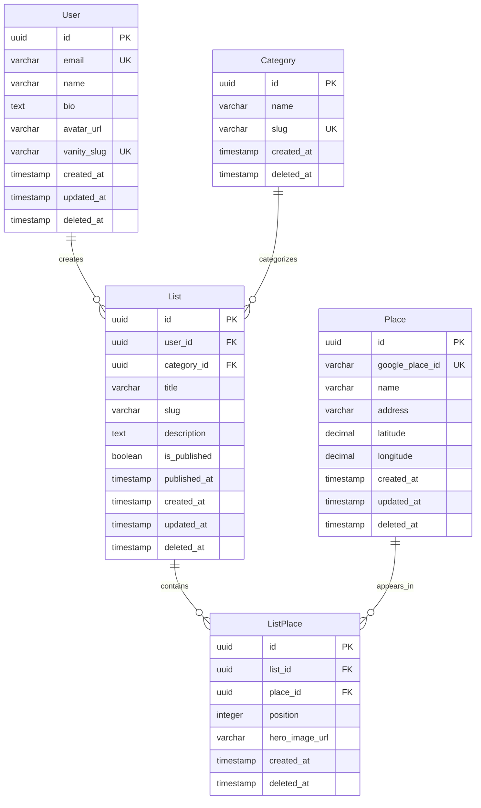

# Data Model: Local Development Environment Setup

**Feature**: 001-local-dev-setup | **Date**: 2025-11-28

## Overview

This document defines the database schema for the YourFavs platform using Drizzle ORM with PostgreSQL. The schema includes all five core entities defined in the high-level architecture.

## Entity Definitions

### User

Represents a creator profile with authentication and customization capabilities.

```typescript
// src/db/schema/user.ts
import {
  pgTable,
  uuid,
  varchar,
  text,
  timestamp,
  index,
  uniqueIndex,
} from "drizzle-orm/pg-core";

export const users = pgTable(
  "users",
  {
    id: uuid("id").primaryKey().defaultRandom(),
    email: varchar("email", { length: 255 }).notNull().unique(),
    name: varchar("name", { length: 255 }).notNull(),
    bio: text("bio"),
    avatarUrl: varchar("avatar_url", { length: 2048 }),
    vanitySlug: varchar("vanity_slug", { length: 50 }).notNull().unique(),
    createdAt: timestamp("created_at", { withTimezone: true })
      .defaultNow()
      .notNull(),
    updatedAt: timestamp("updated_at", { withTimezone: true })
      .defaultNow()
      .notNull(),
    deletedAt: timestamp("deleted_at", { withTimezone: true }),
  },
  (table) => ({
    vanitySlugIdx: uniqueIndex("users_vanity_slug_idx").on(table.vanitySlug),
    deletedAtIdx: index("users_deleted_at_idx").on(table.deletedAt),
  })
);
```

**Fields**:
| Field | Type | Constraints | Description |
|-------|------|-------------|-------------|
| id | UUID | PK, auto-generated | Unique identifier |
| email | VARCHAR(255) | NOT NULL, UNIQUE | User email address |
| name | VARCHAR(255) | NOT NULL | Display name |
| bio | TEXT | NULLABLE | Profile biography |
| avatarUrl | VARCHAR(2048) | NULLABLE | Profile image URL |
| vanitySlug | VARCHAR(50) | NOT NULL, UNIQUE | Custom URL slug (e.g., `@alex`) |
| createdAt | TIMESTAMP | NOT NULL, default NOW | Record creation time |
| updatedAt | TIMESTAMP | NOT NULL, default NOW | Last update time |
| deletedAt | TIMESTAMP | NULLABLE | Soft delete timestamp |

**Validation Rules**:

- `email`: Valid email format
- `vanitySlug`: Alphanumeric and hyphens only, 3-50 characters, lowercase
- `name`: 1-255 characters

---

### Category

System-defined classification types for lists.

```typescript
// src/db/schema/category.ts
import {
  pgTable,
  uuid,
  varchar,
  timestamp,
  uniqueIndex,
} from "drizzle-orm/pg-core";

export const categories = pgTable(
  "categories",
  {
    id: uuid("id").primaryKey().defaultRandom(),
    name: varchar("name", { length: 100 }).notNull(),
    slug: varchar("slug", { length: 100 }).notNull().unique(),
    createdAt: timestamp("created_at", { withTimezone: true })
      .defaultNow()
      .notNull(),
    deletedAt: timestamp("deleted_at", { withTimezone: true }),
  },
  (table) => ({
    slugIdx: uniqueIndex("categories_slug_idx").on(table.slug),
  })
);
```

**Fields**:
| Field | Type | Constraints | Description |
|-------|------|-------------|-------------|
| id | UUID | PK, auto-generated | Unique identifier |
| name | VARCHAR(100) | NOT NULL | Display name (e.g., "Coffee & Cafés") |
| slug | VARCHAR(100) | NOT NULL, UNIQUE | URL-friendly identifier |
| createdAt | TIMESTAMP | NOT NULL, default NOW | Record creation time |
| deletedAt | TIMESTAMP | NULLABLE | Soft delete timestamp |

**Seed Data**:
| slug | name |
|------|------|
| coffee-cafes | Coffee & Cafés |
| restaurants | Restaurants |
| bars-nightlife | Bars & Nightlife |
| breakfast-brunch | Breakfast & Brunch |
| date-night | Date Night |
| family-friendly | Family-Friendly |
| outdoor-nature | Outdoor & Nature |
| workspaces | Workspaces & Co-working |

---

### List

User-curated collection of places within a category.

```typescript
// src/db/schema/list.ts
import {
  pgTable,
  uuid,
  varchar,
  text,
  boolean,
  timestamp,
  index,
  uniqueIndex,
} from "drizzle-orm/pg-core";
import { users } from "./user";
import { categories } from "./category";

export const lists = pgTable(
  "lists",
  {
    id: uuid("id").primaryKey().defaultRandom(),
    userId: uuid("user_id")
      .notNull()
      .references(() => users.id),
    categoryId: uuid("category_id")
      .notNull()
      .references(() => categories.id),
    title: varchar("title", { length: 255 }).notNull(),
    slug: varchar("slug", { length: 255 }).notNull(),
    description: text("description"),
    isPublished: boolean("is_published").default(false).notNull(),
    publishedAt: timestamp("published_at", { withTimezone: true }),
    createdAt: timestamp("created_at", { withTimezone: true })
      .defaultNow()
      .notNull(),
    updatedAt: timestamp("updated_at", { withTimezone: true })
      .defaultNow()
      .notNull(),
    deletedAt: timestamp("deleted_at", { withTimezone: true }),
  },
  (table) => ({
    userSlugIdx: uniqueIndex("lists_user_slug_idx").on(
      table.userId,
      table.slug
    ),
    userDeletedAtIdx: index("lists_user_deleted_at_idx").on(
      table.userId,
      table.deletedAt
    ),
    categoryPublishedIdx: index("lists_category_published_idx").on(
      table.categoryId,
      table.isPublished,
      table.deletedAt
    ),
  })
);
```

**Fields**:
| Field | Type | Constraints | Description |
|-------|------|-------------|-------------|
| id | UUID | PK, auto-generated | Unique identifier |
| userId | UUID | FK → users.id, NOT NULL | Owning user |
| categoryId | UUID | FK → categories.id, NOT NULL | List category |
| title | VARCHAR(255) | NOT NULL | List title |
| slug | VARCHAR(255) | NOT NULL, unique per user | URL-friendly identifier |
| description | TEXT | NULLABLE | List description |
| isPublished | BOOLEAN | NOT NULL, default FALSE | Publication status |
| publishedAt | TIMESTAMP | NULLABLE | First publication time |
| createdAt | TIMESTAMP | NOT NULL, default NOW | Record creation time |
| updatedAt | TIMESTAMP | NOT NULL, default NOW | Last update time |
| deletedAt | TIMESTAMP | NULLABLE | Soft delete timestamp |

**State Transitions**:

- **Draft → Published**: Set `isPublished = true`, set `publishedAt` if null
- **Published → Draft**: Set `isPublished = false`, retain `publishedAt`
- **Any → Deleted**: Set `deletedAt` to current timestamp

---

### Place

Cached location data from Google Places API.

```typescript
// src/db/schema/place.ts
import {
  pgTable,
  uuid,
  varchar,
  decimal,
  timestamp,
  uniqueIndex,
} from "drizzle-orm/pg-core";

export const places = pgTable(
  "places",
  {
    id: uuid("id").primaryKey().defaultRandom(),
    googlePlaceId: varchar("google_place_id", { length: 255 })
      .notNull()
      .unique(),
    name: varchar("name", { length: 255 }).notNull(),
    address: varchar("address", { length: 500 }).notNull(),
    latitude: decimal("latitude", { precision: 10, scale: 7 }).notNull(),
    longitude: decimal("longitude", { precision: 10, scale: 7 }).notNull(),
    createdAt: timestamp("created_at", { withTimezone: true })
      .defaultNow()
      .notNull(),
    updatedAt: timestamp("updated_at", { withTimezone: true })
      .defaultNow()
      .notNull(),
    deletedAt: timestamp("deleted_at", { withTimezone: true }),
  },
  (table) => ({
    googlePlaceIdIdx: uniqueIndex("places_google_place_id_idx").on(
      table.googlePlaceId
    ),
  })
);
```

**Fields**:
| Field | Type | Constraints | Description |
|-------|------|-------------|-------------|
| id | UUID | PK, auto-generated | Unique identifier |
| googlePlaceId | VARCHAR(255) | NOT NULL, UNIQUE | Google Places API ID |
| name | VARCHAR(255) | NOT NULL | Place name |
| address | VARCHAR(500) | NOT NULL | Formatted address |
| latitude | DECIMAL(10,7) | NOT NULL | Geographic latitude |
| longitude | DECIMAL(10,7) | NOT NULL | Geographic longitude |
| createdAt | TIMESTAMP | NOT NULL, default NOW | Record creation time |
| updatedAt | TIMESTAMP | NOT NULL, default NOW | Last refresh time |
| deletedAt | TIMESTAMP | NULLABLE | Soft delete timestamp |

---

### ListPlace

Junction table for list-place relationships with ordering.

```typescript
// src/db/schema/listPlace.ts
import {
  pgTable,
  uuid,
  integer,
  varchar,
  timestamp,
  index,
  uniqueIndex,
} from "drizzle-orm/pg-core";
import { lists } from "./list";
import { places } from "./place";

export const listPlaces = pgTable(
  "list_places",
  {
    id: uuid("id").primaryKey().defaultRandom(),
    listId: uuid("list_id")
      .notNull()
      .references(() => lists.id),
    placeId: uuid("place_id")
      .notNull()
      .references(() => places.id),
    position: integer("position").notNull(),
    heroImageUrl: varchar("hero_image_url", { length: 2048 }),
    createdAt: timestamp("created_at", { withTimezone: true })
      .defaultNow()
      .notNull(),
    deletedAt: timestamp("deleted_at", { withTimezone: true }),
  },
  (table) => ({
    listPositionIdx: index("list_places_list_position_idx").on(
      table.listId,
      table.position
    ),
    listPlaceIdx: uniqueIndex("list_places_list_place_idx").on(
      table.listId,
      table.placeId
    ),
  })
);
```

**Fields**:
| Field | Type | Constraints | Description |
|-------|------|-------------|-------------|
| id | UUID | PK, auto-generated | Unique identifier |
| listId | UUID | FK → lists.id, NOT NULL | Parent list |
| placeId | UUID | FK → places.id, NOT NULL | Referenced place |
| position | INTEGER | NOT NULL | Sort order (1-based) |
| heroImageUrl | VARCHAR(2048) | NULLABLE | Selected image from Google Places |
| createdAt | TIMESTAMP | NOT NULL, default NOW | Record creation time |
| deletedAt | TIMESTAMP | NULLABLE | Soft delete timestamp |

---

## Relationships



---

## Indexes Summary

| Table       | Index                                   | Type   | Purpose                    |
| ----------- | --------------------------------------- | ------ | -------------------------- |
| users       | vanity_slug                             | UNIQUE | Profile URL lookup         |
| users       | deleted_at                              | B-TREE | Exclude soft-deleted users |
| categories  | slug                                    | UNIQUE | Category URL lookup        |
| lists       | (user_id, slug)                         | UNIQUE | List URL lookup            |
| lists       | (user_id, deleted_at)                   | B-TREE | Creator's lists query      |
| lists       | (category_id, is_published, deleted_at) | B-TREE | Category browse            |
| places      | google_place_id                         | UNIQUE | Deduplication              |
| list_places | (list_id, position)                     | B-TREE | Ordered place retrieval    |
| list_places | (list_id, place_id)                     | UNIQUE | Prevent duplicates         |

---

## Schema Index File

```typescript
// src/db/schema/index.ts
export * from "./user";
export * from "./category";
export * from "./list";
export * from "./place";
export * from "./listPlace";
```

---

## Migration Strategy

1. **Generate migration**: `pnpm drizzle-kit generate:pg`
2. **Apply migration**: `pnpm drizzle-kit push:pg` (development)
3. **Production**: Use versioned SQL files from `src/db/migrations/`

---

## Soft Delete Convention

All queries MUST filter by `deleted_at IS NULL` to exclude soft-deleted records. Example:

```typescript
// Correct: Excludes soft-deleted records
const activeUsers = await db
  .select()
  .from(users)
  .where(isNull(users.deletedAt));

// Soft delete a record
await db
  .update(users)
  .set({ deletedAt: new Date() })
  .where(eq(users.id, userId));
```
